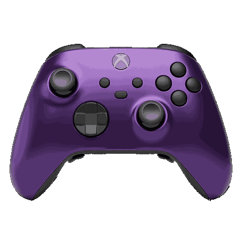

# Connecting a control surface

MoonLight's [Control](../moonmodules/core/system.md#control) card is a surface: eight switches, eight encoders, eight faders and a pad grid, each driving whatever you assign it. A control surface puts those controls under your hands. It can be a phone or tablet, a game controller, or a motorized mixing desk whose faders move when something else changes them.

> New here? Start with **[Install & first light](../gettingstarted.md)**. What follows assumes MoonLight is running and you can find it in a browser.

---

## Pick a route

| What you have | Route | What it needs |
|---|---|---|
| A phone, a tablet or another app | [OSC](#a-phone-or-tablet-over-osc) | Open Stage Control, TouchOSC, Resolume, TouchDesigner or QLC+ on the same network |
| A MIDI desk (Mackie Control, such as the X-Touch or the QCon) or a gamepad | [The browser](#a-midi-desk-or-a-gamepad-through-the-browser) | The desk or pad plugged into the computer showing MoonLight's page |
| One desk for boards elsewhere in the rig | [The desktop app plus OSC](#one-desk-for-several-boards) | MoonLight running on the computer the desk is plugged into |
| A script or program of your own | [The REST API](../reference/integrating.md) | Set `Control`'s `fader1`, `switch2` or any other surface control, as every other route does |

Every route lands on the same surface, so a desk, a phone and the web UI stay in step: move a fader on one and the others follow.

---

## A MIDI desk or a gamepad, through the browser

1. In MoonLight add the service under **Services**: **Midi** for a desk, **Gamepad** for a controller.
2. Plug the desk or pad into the computer showing MoonLight's page, in Chrome, Edge or Firefox.
3. A desk: Chrome asks to use MIDI devices the first time; allow it. A pad: press any button, and the browser lists it.
4. Assign the surface's controls on the Control card, such as `fader2` to a game's paddle.

A Mackie desk in MC mode needs no setup: faders, knobs, SELECT buttons, touch sensors, motors and lights are mapped. An Akai APC40 mkII needs one choice: set the MIDI service's `profile` to Akai APC40 mkII, and its faders, knobs, activator buttons and clip pads are mapped, with their lights. A gamepad comes with default rows for its sticks and its A button.

 

The browser offers MIDI and gamepads on a secure origin only. The desktop app's page on `localhost` is one; a board's own page, such as `http://192.168.1.158`, needs its address marked as secure once, as [MIDI, details](../moonmodules/core/services.md#midi-details) shows.

---

## One desk for several boards

The desk plugs into a computer running the MoonLight desktop app, and the app passes its surface on to the boards over OSC.

1. On the desktop app, set up the desk as in the route above, on `localhost`.
2. On the desktop app: **Services → OSC**, turn on `listen` and `feedback`, and set `feedbackPort` to `9000`.
3. Pick how the surface travels:
    - **A few known boards:** `addressing` `unicast`, with the boards in `hosts`: `192.168.1.139, MM-testbench-S3.local`. Every board gets its own copy, retried by WiFi.
    - **Any number of boards:** `addressing` `multicast`. Every board listening on the default `group` hears it; a second rig on the same network gives its desktop and boards another `group`.
4. On each board: **Services → OSC**, turn on `listen`.

Every change on the desktop's surface now reaches the boards' surfaces, a self-playing game's moving paddle included.

---

## A phone or tablet, over OSC

Eight switches, eight knobs and eight faders on a touchscreen, moving the device in real time and following it when something else moves it. It takes about five minutes, using a free app and one file.

### The short version

1. Install **[Open Stage Control](https://openstagecontrol.ammd.net/)** (free; macOS, Windows, Linux)
2. Download **[MoonLight-control-surface.json](https://github.com/MoonModules/MoonLight/releases/download/latest/MoonLight-control-surface.json)**
3. In its launcher set `send` to `<your-device-ip>:9000`, `osc-port` to `9001`, and `load` to the file
4. On the device: **Services → OSC**, turn on `listen` and `feedback`
5. Press start

The faders move the device; moving something in the MoonLight UI moves the faders back.

---

### 1. What this gives you

MoonLight's Control card is a surface: a row of switches, a row of encoders, a row of faders, each of which can drive something on the device. The web UI shows it, but a mouse can only touch one control at a time.

A **control surface** is that same row of controls on something you can put your hands on. Open Stage Control is a free app that draws one on any screen, including a phone or tablet browser, and speaks **OSC**, the protocol MoonLight listens for.

Two things make this worth the five minutes:

- **Several at once.** Ten fingers on a touchscreen, not one mouse pointer.
- **It follows the device.** Change brightness in the web UI, or recall a preset, and the fader moves to match. The surface and the device never disagree about a value.

Today `switch1` drives the master on/off and `fader1` drives the global brightness. The rest are wired and waiting for assignments.

---

### 2. Find your device's IP address

The surface sends to an address, so you need the one your device is on.

It is in the MoonLight UI on the **System** card, and it is the same address you typed into the browser to get there. On a desktop install talking to itself, it is `127.0.0.1`.

Write it down; it goes in step 5.

---

### 3. Install Open Stage Control

Download it from **[openstagecontrol.ammd.net](https://openstagecontrol.ammd.net/)**. It is free and open source, and runs on macOS, Windows and Linux.

**On macOS the first launch needs a right-click → Open**, once. The download is unsigned, so a double-click gets refused with a warning about an unidentified developer. Right-click, choose Open, confirm, and macOS remembers.

---

### 4. Get the session file

A **session** is the layout: which knobs exist, what they look like, and what each one sends. You do not have to build one.

**[Download MoonLight-control-surface.json](https://github.com/MoonModules/MoonLight/releases/download/latest/MoonLight-control-surface.json)**

That link always serves the newest session, built from the latest code, and it sits beside the firmware on the [releases page](https://github.com/MoonModules/MoonLight/releases) if you would rather find it there.

Save it somewhere you can find again. The file does not contain your device's address, so the same file works for every device you own.

---

### 5. Point it at your device

Open Stage Control opens a **launcher** first, a settings window, before it draws anything. Three fields matter:

| Field | Value | What it means |
|---|---|---|
| `send` | `<your-device-ip>:9000` | where the surface sends. `9000` is the port MoonLight listens on |
| `osc-port` | `9001` | where the surface LISTENS, so the device can answer |
| `load` | the file from step 4 | the layout to draw |

So a device at `192.168.1.42` gets `send` = `192.168.1.42:9000`.

The two ports are different on purpose and this is the one place people go wrong: `9000` is the device's ear, `9001` is the surface's ear. They are not interchangeable.

> Leave `read-only` **off** if you want to rearrange the layout later. On to keep it as shipped.

Press the start button. The surface appears.

---

### 6. Turn the device's side on

In MoonLight: **Services → OSC**.

| Control | Set to | Why |
|---|---|---|
| `listen` | on | accept incoming OSC. Without it the device ignores the surface entirely |
| `feedback` | on | answer back, so the faders follow the device |
| `feedbackPort` | `9001` | where to answer. Must match the `osc-port` from step 5 |
| `port` | `9000` | where the device listens. Matches the `send` port |

Leave `hosts` empty, with `addressing` on `unicast`. Empty means "answer whoever last wrote to us", which finds your surface on its own. Fill it in only when you want feedback sent somewhere other than the thing driving it.

Move a fader. The device should react immediately.

---

### 7. Use it from a phone

This is where it gets good, and it needs no extra setup.

Open Stage Control also serves the surface as a **web page**. While it is running, look at its console output for a line naming a port (`8080` by default). On any phone or tablet on the same network, browse to:

```text
http://<the-computer-running-open-stage-control>:8080
```

Same surface, on a touchscreen, with ten fingers instead of one pointer. The computer running Open Stage Control stays the middleman; the phone talks to it, and it talks to the device.

> If MoonLight's own UI is on port 8080 on that same machine, give Open Stage Control a different port in its launcher, or the two collide.

---

### 8. When you see nothing

The surface draws fine but the device does not move, or the faders sit at zero and never follow. In rough order of likelihood:

**The device is not listening.** `listen` off is the most common cause, and it is off by default. Services → OSC → `listen` on.

**Wrong IP.** Check the System card again. A device that got a new address from DHCP after a reboot is a classic one: the surface is faithfully sending to nobody.

**The two ports are swapped.** `send` must end in `:9000`, `osc-port` must be `9001`. Swapping them produces exactly this symptom: nothing moves, nothing errors.

**`feedbackPort` does not match.** If the device moves but the faders never follow, the outbound direction is misconfigured while the inbound one is fine. `feedbackPort` on the device must equal `osc-port` in the launcher.

**A firewall.** OSC is UDP. macOS and Windows both prompt on first use, and a refused prompt is silent afterwards. Allow Open Stage Control through, or check the firewall's list if you clicked deny.

**The widgets show the wrong values on load.** They should populate immediately, because the session asks the device for its state whenever the page opens. If they do not, the device is not answering: check `feedback` and `feedbackPort`.

To prove the device is reachable at all, from a checkout:

```sh
uv run moondeck/check/send_osc.py <device-ip> /mm/fader/1 0.75
```

Brightness should jump. If that works and the surface does not, the problem is on the surface's side.

---

### 9. One command, if you have the repo

With a checkout, skip steps 3 to 6 entirely:

```sh
uv run moondeck/run/run_open_stage_control.py --host 192.168.1.42
```

It finds the app, passes the session, the address and both ports, and runs it headless. Open **http://127.0.0.1:8088**. You still turn `listen` and `feedback` on at the device.

Full options are on the [OSC module's page](../moonmodules/core/services.md).

---

### What the surface sends

Worth knowing if you ever edit the layout.

Each control sends to an address naming **the surface**, not the thing it drives:

```text
/mm/switch/1 … /mm/switch/8
/mm/encoder/1 … /mm/encoder/8
/mm/fader/1 … /mm/fader/8
/mm/pad/1 … /mm/pad/64
/mm/padstate/1 … /mm/padstate/64
```

The device decides what each one drives. That is deliberate: reassign `fader3` from brightness to speed, and the layout does not change, because the layout never knew. It also means a hardware desk added later lands on the same addresses.

A pad applies the preset stored on that pad of the Control card's grid, counted from the top left. Its light listens on `/mm/padstate/N`: dark when the pad is empty, dim when it holds a preset, bright for the one applied.

---

## Where to go next

- **[OSC module reference](../moonmodules/core/services.md)**: every control, the feedback rules, `/mm/hello`
- **[Control card](../moonmodules/core/system.md#control)**: the surface the device owns, and what each control drives
- **[MIDI and Gamepad services](../moonmodules/core/services.md#midi)**: what each desk control and pad input does
- **[Control surfaces](../reference/hardware/control-surfaces.md)**: the X-Touch and QCon hardware, and Mackie Control on the wire
