# The StadBeest: a multi-device installation

**Meet the StadBeest**, a creature made of what the city throws away.
Its body is a chandelier on ten legs of light, its eyes sit in 3D-printed light bulbs, and its mouth is an ordinary WiFi lamp.
It listens to the music around it, takes a step and looks around on every beat, and picks its own colors and moods through the night.
A handful of small computers run it together on MoonLight, free lighting software made by volunteers.

<video src="../assets/how-to/multi-board/stadbeest.mp4" width="300" autoplay loop muted playsinline title="The StadBeest walking: ten glowing legs on a chandelier body and two ring-disc eyes"></video>

**What did you think of it?** A few words are enough, and we read every one.

[:material-message-text: Leave us a message](https://tally.so/r/68X5xO){ .md-button .md-button--primary } &nbsp; [:fontawesome-brands-discord: Discord](https://discord.gg/TC8NSUSCdV){ .md-button } &nbsp; [:fontawesome-brands-reddit: Reddit](https://reddit.com/r/moonmodules){ .md-button }

**Curious how it is made, or want to build your own?** Read on for the whole recipe, from the hardware to the code.

---

An installation is several MoonLight devices that act as one piece: one creature, one sculpture, one room.
The worked example is the StadBeest, whose legs, eyes and mouth run on devices of their own.
Each section names a choice that makes it work; borrow what fits your own piece.

> **Start simple.** The StadBeest shows most of what MoonLight can do in one piece, so it can look overwhelmingly complex.
> An installation needs far less to act as one piece:
>
> - One device, one effect, a layout sized to the part: a piece in itself.
> - Two or three devices, each running its own effect, all hearing the same music: they move on one beat with no link between them.
> - One of them leading over OSC: one slider or desk steers them all.
>
> Start with the first, see it run, and add the next step only when you miss it. The autopilot, the desk, the looks and the mouth came last, one at a time.

> New here? Start with **[Install & first light](../gettingstarted.md)** and **[your first script](../tutorials/first-script.md)**. What follows assumes devices that run MoonLight on one network.

---

## The StadBeest at a glance

| part | hardware | lights | layout | effect |
|---|---|---|---|---|
| legs | LightCrafter 16 (ESP32-S3 N8R8) | 10 SK6812 RGBW strips of 144 | Tubes, `tubeDistance` 7 | [`stadbeest-walk.mle`](https://github.com/MoonModules/MoonLight/blob/main/moonlive/effects/stadbeest-walk.mle), [`stadbeest-orb.mle`](https://github.com/MoonModules/MoonLight/blob/main/moonlive/effects/stadbeest-orb.mle), [`stadbeest-thrusters.mle`](https://github.com/MoonModules/MoonLight/blob/main/moonlive/effects/stadbeest-thrusters.mle) |
| left eye | ESP32-S3-Zero, 4 MB | a 241-light ring disc | Rings241 | [`stadbeest-frog-eye.mle`](https://github.com/MoonModules/MoonLight/blob/main/moonlive/effects/stadbeest-frog-eye.mle), [`stadbeest-eye-orb.mle`](https://github.com/MoonModules/MoonLight/blob/main/moonlive/effects/stadbeest-eye-orb.mle), [`stadbeest-sauron.mle`](https://github.com/MoonModules/MoonLight/blob/main/moonlive/effects/stadbeest-sauron.mle) |
| right eye | ESP32-S3-Zero, 4 MB | a 241-light ring disc | Rings241 | the same three as the left eye |
| mouth | ESP32-C3 RGBWW PWM bulb | one RGBWW light | Grid 1×1×1 | [`stadbeest-mouth.mle`](https://github.com/MoonModules/MoonLight/blob/main/moonlive/effects/stadbeest-mouth.mle) |

The three looks, as each device's preview shows them; the mouth, one light, breathes along with each.

| look | legs | eyes |
|---|---|---|
| walking | 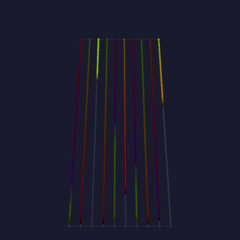 | 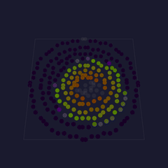 |
| the orb | 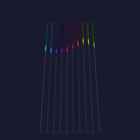 | 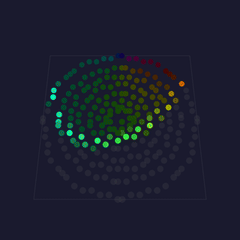 |
| the thrusters | 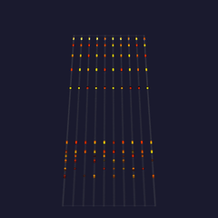 | 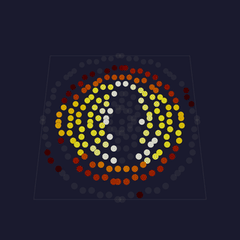 |

The legs device leads: its control surface holds the shared settings, and the eyes and the mouth follow it over OSC.
Every device hears the same music through WLED audio sync, so legs, eyes and mouth move on the same beat.
See it at the [Museumnacht Den Haag](https://museumnachtdenhaag.nl/programma/het-stad-beest-ontwaakt/), where it runs through the night as *Het Stad Beest ontwaakt*.

---

## How the StadBeest is made

The body is built on a chandelier, and the eyes ride on bendable lamp arms, both found in a second-hand store.
Each eye sits in a 3D-printed bulb body, shaped like a lamp with a screw base.
A printed top plate screws onto the body and holds the 241-light ring disc.

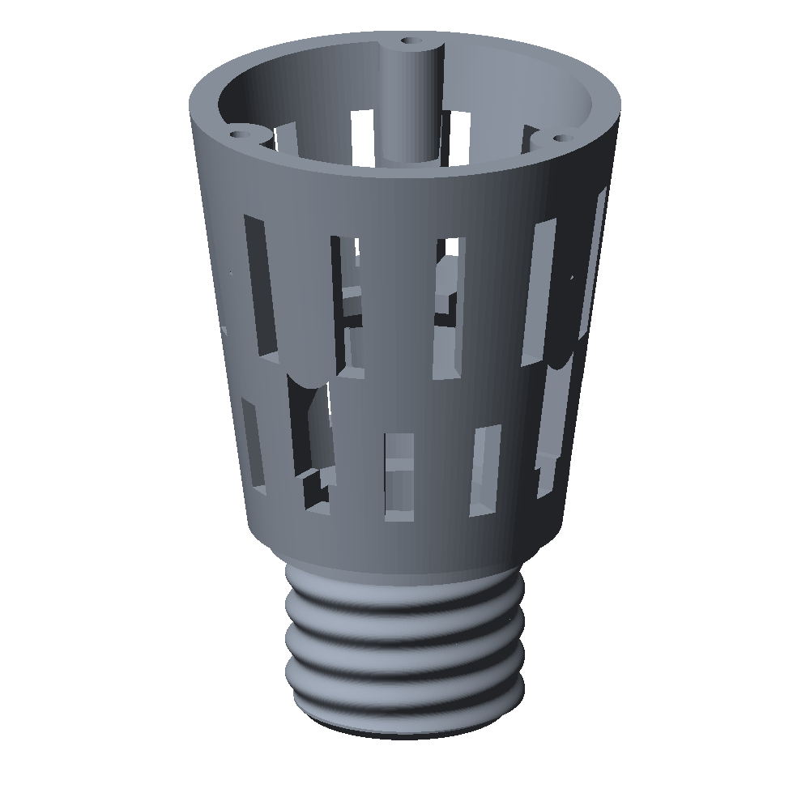 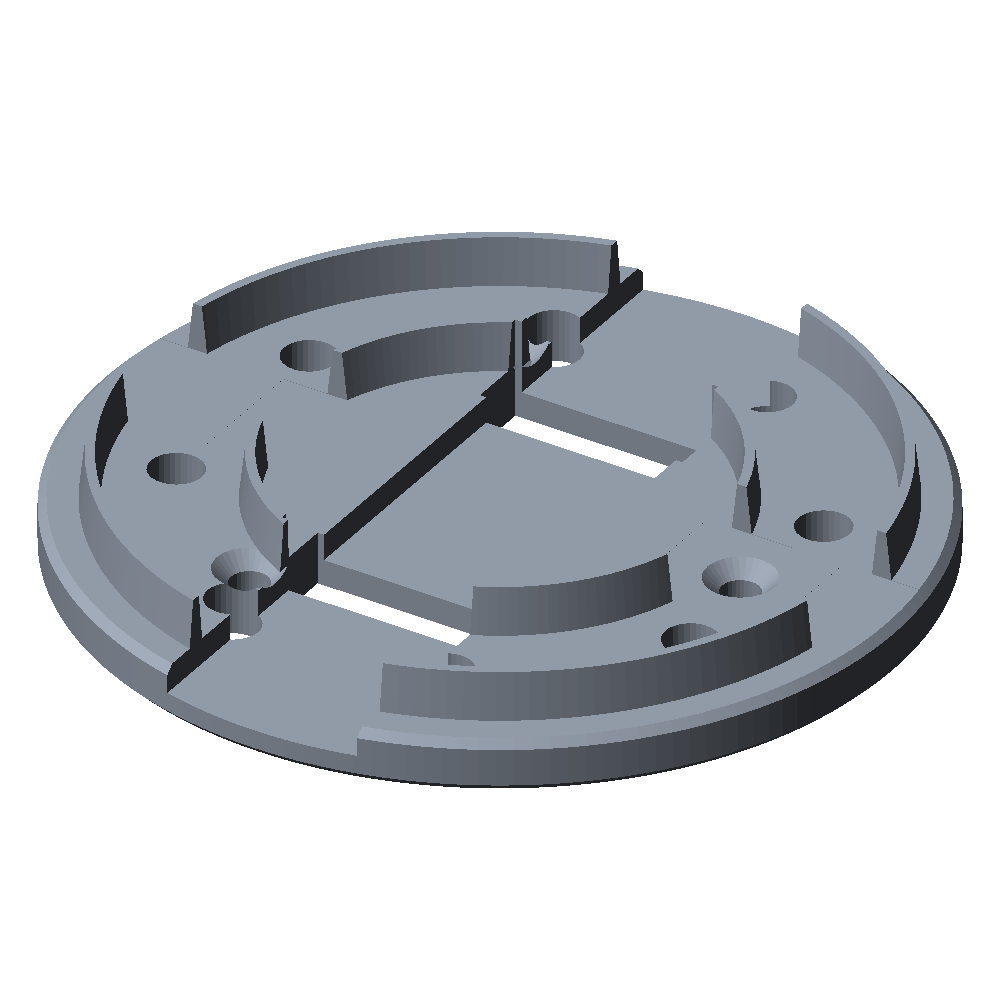

Each leg is a tube that holds one LED strip.
A printed connector joins the top of a tube to the chandelier, and a printed foot closes the bottom, with a slot for the strip's cable.

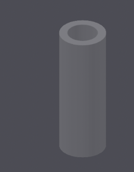 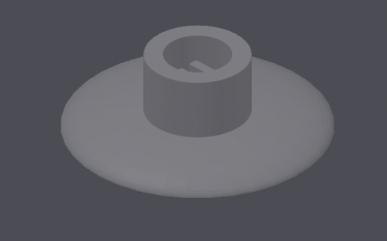

---

## 1. One device per part

Give each physical part its own device and its own layout, sized to that part.
A part then keeps its own frame rate, effect and brightness limits.
A failing device takes down one part rather than the piece.
The layout decides what an effect can show: the legs are ten vertical strips, the eyes are nine concentric rings, and each effect is written for exactly that shape.

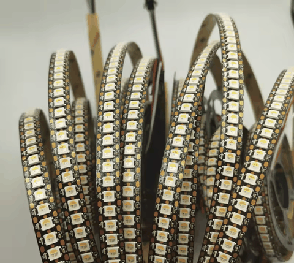 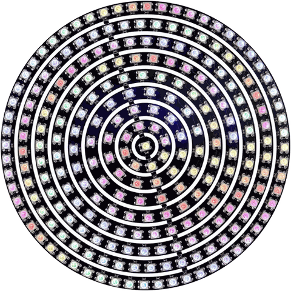

The legs run on a LightCrafter 16, a 16-channel LED driver board with Ethernet, using ten of its channels.
Each eye runs on an ESP32-S3-Zero, small enough to fit inside the printed bulb.
The mouth is a WiFi light bulb that ran WLED, moved to MoonLight without opening it: [migrating over the air](migrating-over-the-air.md).
A second bulb is a backup mouth, migrated the same way.
It takes the first bulb's scripts and its `Services`, `Effects` and `Drivers` config files, and follows the legs at once, since they send to a group any device joins.

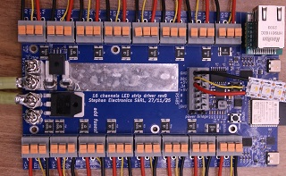 

---

## 2. Effects written for the hardware

The StadBeest has three looks, each a pair of [MoonLive](../moonmodules/light/moonlive.md) scripts, one for the legs and one for the eyes: walking, the orb and the thrusters. Most of what makes them read well is design rather than code.

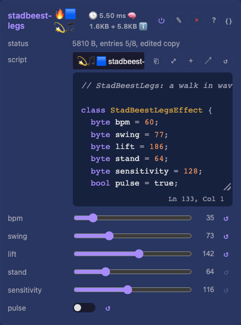 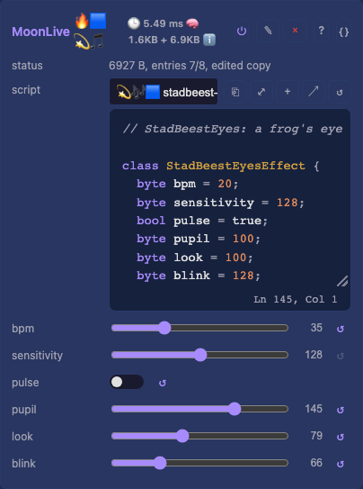

**Draw for the medium.**
A ring disc has nine rings, from one light in the center to sixty at the edge.
So the eye is built from ring zones: a dark pupil, a palette iris, a dim rim.
Fine detail such as iris fibers disappears at that resolution, and a slit pupil reads only when it is a light wide at its middle.

**Move few things at once.**
In a real walk most legs stand still while one or two lift.
The legs effect keeps every leg lit and standing, and lifts each one briefly in a wave from back to front, the two sides half a cycle apart.
A creature reads as alive when the eye can follow what moves.

**Let it travel.**
A gaze that jumps to its next target reads as a glitch; one that eases there reads as an eye.
The pupil eases in and out of each move over 400 ms, in sixteenths of a light, so its edge slides across the rings.

**Tie color to movement.**
A standing leg holds its colors, a lifting leg carries them up with its foot, and each step moves the palette on a quarter.
The eye's colors move on with each dart of its gaze.
Color that drifts on its own competes with the motion instead of showing it.

**Listen to the right signal.**

- `audioBeat()` for timing: the legs step and the eyes dart on the beat.
- `audioSmooth()` for size: louder music lifts the legs higher and widens the pupil.
- A flash on the beat that fades over half a second, for brightness.

The raw frequency bands change every frame, and driven straight into brightness or height they look random.

**Use the space the lights stand in.**
The ten legs stand in a ring, so a second layer on the legs device, the orb, places leg *n* at *n* × 36° on a circle.
It floats a shape up and down through the ring: a tilted disc that wobbles as it turns, a ball that lights each leg twice, an egg that leans.
Each leg lights where it crosses the shape's shell, so flat strips draw a solid in the air.
The eyes show the same shape through a window: `stadbeest-eye-orb` takes the orb's controls and draws where the shell crosses the disc, scaled so the disc spans the legs' height.

**Let the medium carry the physics.**
In the thrusters look each leg is a rocket's plume, a [particle](../moonmodules/light/moonlive.md#the-vocabulary) stream pouring down from the body.
The sparks leave the nozzle almost at rest and fall, so they stay on their one-light-wide leg, and a plume's length is how long its sparks live.
Louder music burns longer and every beat fires a burst; without music the thrusters fire short bursts around the ring, and every fourth burst all of them.
The eyes become one burning eye, `stadbeest-sauron`: a fiery iris around a black slit that searches left and right and narrows on the beat.

**Let two devices agree without talking.**
The eyes pick each dart's direction from `audioPeakHz()` at the beat, which both devices read the same.
So they look the same way at the same moment, with no message between them.

**Use them yourself.**
The six looks and the autopilot are part of MoonLight's [script library](https://github.com/MoonModules/MoonLight/tree/main/moonlive).
Every device running MoonLight lists them in its script picker and downloads one when it is chosen.
The full code: [`stadbeest-walk.mle`](https://github.com/MoonModules/MoonLight/blob/main/moonlive/effects/stadbeest-walk.mle), [`stadbeest-orb.mle`](https://github.com/MoonModules/MoonLight/blob/main/moonlive/effects/stadbeest-orb.mle), [`stadbeest-thrusters.mle`](https://github.com/MoonModules/MoonLight/blob/main/moonlive/effects/stadbeest-thrusters.mle), [`stadbeest-frog-eye.mle`](https://github.com/MoonModules/MoonLight/blob/main/moonlive/effects/stadbeest-frog-eye.mle), [`stadbeest-eye-orb.mle`](https://github.com/MoonModules/MoonLight/blob/main/moonlive/effects/stadbeest-eye-orb.mle), [`stadbeest-sauron.mle`](https://github.com/MoonModules/MoonLight/blob/main/moonlive/effects/stadbeest-sauron.mle) and [`stadbeest-autopilot.mls`](https://github.com/MoonModules/MoonLight/blob/main/moonlive/services/stadbeest-autopilot.mls); to write your own, start with [your first script](../tutorials/first-script.md).

---

## 3. Iterate on the device

A script is a file, so the fastest loop is to edit it where it runs.

1. Write it to the device: `curl -X POST -H "Expect:" --data-binary @walk.mle "http://<device>/api/file?path=/moonlive/stadbeest-walk.mle"`.
2. Read the effect's status on its card or in `/api/state`: a compile error shows there with its position.
3. Judge it on the real lights, then change one thing.

A file in `/moonlive` shadows the factory script of the same name, so the device runs your copy until you delete it ([scripts on a device](../reference/integrating.md)).
A script that does not compile leaves its effect dark, so keep the last working version at hand and upload it back before you walk away.

---

## 4. One surface layout for every device

Each device's [Control](../moonmodules/core/system.md#control) card is a desk of eight faders, eight encoders and eight switches.
The first slot of each bank is the device's own.
From the second on the desk follows the look that runs: automap puts that effect's controls on the slots in the order it declares them.

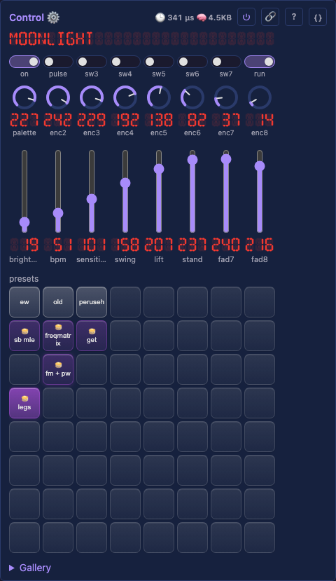

Every StadBeest effect that hears music declares `bpm`, `sensitivity` and `pulse` first, so those slots mean the same on the legs and on the eyes in every look.
The rest are the look's own: on the walk `fader4` is `swing`, on the frog eye it is `pupil`.
A slot assigned by hand keeps its target, which is how the look switches and the autopilot stay put.

| slot | legs | each eye | mouth |
|---|---|---|---|
| `switch1` | `Drivers.on` | `Drivers.on` | `Drivers.on` |
| `switch2` | `pulse` | `pulse` | `pulse` |
| `switch3` | `walk.enabled` | `frog-eye.enabled` | |
| `switch4` | `orb.enabled` | `eye-orb.enabled` | |
| `switch5` | `thrusters.enabled` | `sauron.enabled` | |
| `switch8` | autopilot `run` | | |
| `fader1` | `Drivers.brightness` | `Drivers.brightness` | `Drivers.brightness` |
| `fader2` | `bpm` | `bpm` | `bpm` |
| `fader3` | `sensitivity` | `sensitivity` | `sensitivity` |
| `fader4` to `fader7` | the look's next numbers | the look's next numbers | `rest` |
| `fader8` | autopilot `seconds` | | |
| `encoder1` | `Drivers.palette` | `Drivers.palette` | `Drivers.palette` |
| `encoder2` and on | the look's choices, such as the orb's `shape` | the same | |

A slot holds the value of the control it drives, so `fader2` at 33 means `bpm` 33.
Each look is an effect of its own on every device, named after its script without the `stadbeest-` prefix, and `switch3` to `switch5` turn them on and off through their `enabled`.
So one switch changes the look on the legs and on both eyes at once, and the desk follows it.
Assign a slot by hand from the Control card.

---

## 5. Linking the devices with OSC

The [OSC](../moonmodules/core/services.md#osc) service mirrors a surface to the network, which is all the linking an installation needs.

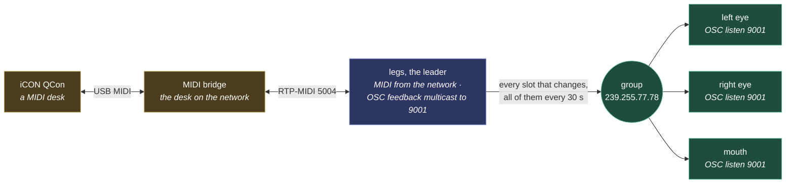

The leader owns the state, and the eyes take it over OSC. The desk is the leader's own, over the network rather than a cable: [a MIDI bridge](#8-driving-it-by-hand-an-akai-apc40-mkii).

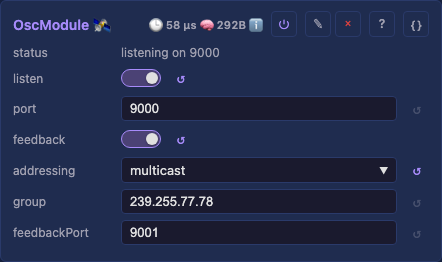 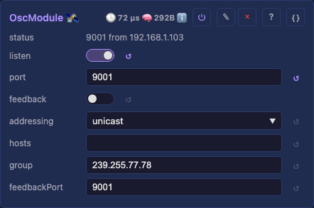

**The leader** (the legs): OSC `feedback` on, `addressing` multicast, `group` the default `239.255.77.78`, `feedbackPort` 9001.
Every slot that changes on the leader, from its card, a preset, a script or a desk, goes out as `/mm/fader/N`, `/mm/encoder/N` or `/mm/switch/N`.

**The followers** (the eyes and the mouth): an OSC service with `listen` on, `port` 9001, the leader's `feedbackPort`, and `feedback` off.
A follower joins the group, writes each message onto its own slot N, and its assignments carry the value to its own controls.
The leader's preset pad states go out on an address of their own, which a follower ignores, so its own presets stay untouched.

Three details matter:

- The followers listen on 9001 and the leader on 9000, so the leader never hears its own feedback, and a follower never answers back.
- A follower takes a value when the leader's slot changes, and the leader sends every slot again every 30 seconds. A value lost on WiFi, or a follower that rebooted, is repaired within that time.
- WiFi multicast drops packets that arrive in a burst, so the leader sends that refresh one slot at a time.
  A writer on the leader spreads its own changes the same way.

---

## 6. One source of music

Every device runs the [Audio](../moonmodules/core/services.md#audio) service in receive mode, and one machine sends WLED audio sync to all of them.
That machine is a device with a microphone, or a computer running MoonLight that captures what it plays.
One source means one beat: the legs step, the eyes dart and every flash lands on the same moment.

Here the source is an [ESP32-S31 CoreBoard](../reference/hardware/esp32-s31-coreboard.md) listening with its on-board microphone, wired by Ethernet to the installation's router: [the network](#10-the-network).

---

## 7. Running unattended

A [MoonLiveService](../moonmodules/core/services.md#moonliveservice) on the leader runs [`stadbeest-autopilot.mls`](https://github.com/MoonModules/MoonLight/blob/main/moonlive/services/stadbeest-autopilot.mls), which plays the beast through a whole museum night without anyone at the desk.

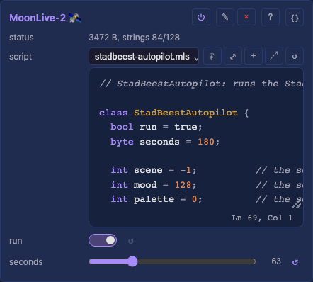

- **Scenes:** every `seconds`, three minutes by default, it picks a new scene.
  A scene moves on to the next look, walking, the orb or the thrusters, by switching `switch3` to `switch5`.
  It picks a built-in palette, in a third of the thrusters scenes [`stadbeest-fire.mlp`](https://github.com/MoonModules/MoonLight/blob/main/moonlive/palettes/stadbeest-fire.mlp), a mood from calm to wild, how much the music counts and `pulse` on or off.
  That palette is computed every frame: louder music burns hotter, a beat flares the hot end white, and the flames flicker.
  A palette has the same number on every device, so the eyes and the mouth pick the same one.
- **Breathing:** within a scene the energy rises and falls once a minute, through `fader2`, the tempo of whatever look runs.
- **Through the surface:** it writes the shared slots with `setControl("fader2", value)`, exactly as a person moves a fader.
  The legs follow on the leader, and the eyes and the mouth over OSC.
- **One slot at a time:** it writes one slot every 20 ms, every ten seconds, so no burst reaches the network.
- **Handing over:** its `run` switch sits on `switch8`; off gives the beast back to people and desks.

---

## 8. Driving it by hand: an Akai APC40 mkII

A desk on the leader moves the whole installation, since its changes go out over OSC like any other.
The StadBeest takes an [Akai APC40 mkII](../reference/hardware/control-surfaces.md#akai-apc40-mkii): faders, knobs and buttons for the shared slots, and a pad per preset.

**Setting it up**

1. On the leader, add a **MIDI** service under **Services** and set its `profile` to `Akai APC40 mkII`.
2. Plug the APC40 into a laptop next to the beast, and open the leader's page in Chrome.
3. Mark the leader's address as secure in Chrome once, as [MIDI, details](../moonmodules/core/services.md#midi-details) shows, since a device's own page is plain `http`.
4. Allow MIDI, with SysEx, when Chrome asks. The desk lights up: the knob rings, the activator lights and the preset pads.

The browser is the bridge between desk and device, so the laptop keeps the leader's page open while the desk is in use.

**Playing it**

| APC40 | the StadBeest |
|---|---|
| track faders 1-7 | brightness, then the look's `bpm`, `sensitivity` and its own numbers |
| track fader 8 | the autopilot's `seconds`, how long a scene lasts |
| track knobs 1-8 | the palette, then the look's choices and the numbers past the faders |
| activator 1 | on and off |
| activator 2 | `pulse`, legs and eyes together |
| activators 3 to 5 | the look: walking, the orb, the thrusters |
| activator 8 | the autopilot's `run` |
| clip pads | the presets, the top-left pad being preset 1; a stored preset glows white and the applied one green |

The autopilot rewrites the shared slots every ten seconds, so switch it off with activator 8 before playing by hand, and on again to hand the beast back.
The eyes and the mouth follow every move over OSC, as they follow the autopilot.
A phone or a tablet reaches the same slots too: [connecting a control surface](control-surface.md).

**Without a laptop: a MIDI bridge**

A desk can also plug into a small device of its own, which puts it on the network: no laptop, and no cable to the beast.
The StadBeest uses an ESP32-S3 N16R8 for it, with an [iCON QCon Pro G2](../reference/hardware/control-surfaces.md#icon-qcon-pro-g2), which has its own power adapter.

1. Install it as the **MIDI bridge** device model, which sets its [MIDI service](../moonmodules/core/services.md#midi) to `source` USB with `share` on.
2. Plug the desk into the board's own USB port, the one marked USB, and power the board from its other port.
3. On the leader's MIDI service, set `source` to network and `host` to the bridge's name, such as `MM-MIDI-rtp.local`, or its address, and pick the desk's `profile` there.

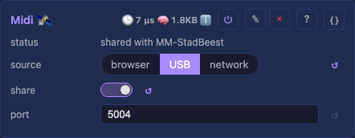 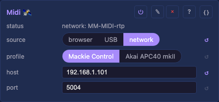

The bridge is a cable over RTP-MIDI, the standard for MIDI on a network, and keeps no state of its own.
So the desk works on the leader as if plugged into it.
The leader greets it, moves its motors, lights its pads with its presets and holds a motor still under a hand.
A Mackie desk's display shows the leader's display line: the last change for five seconds, then the device's name.

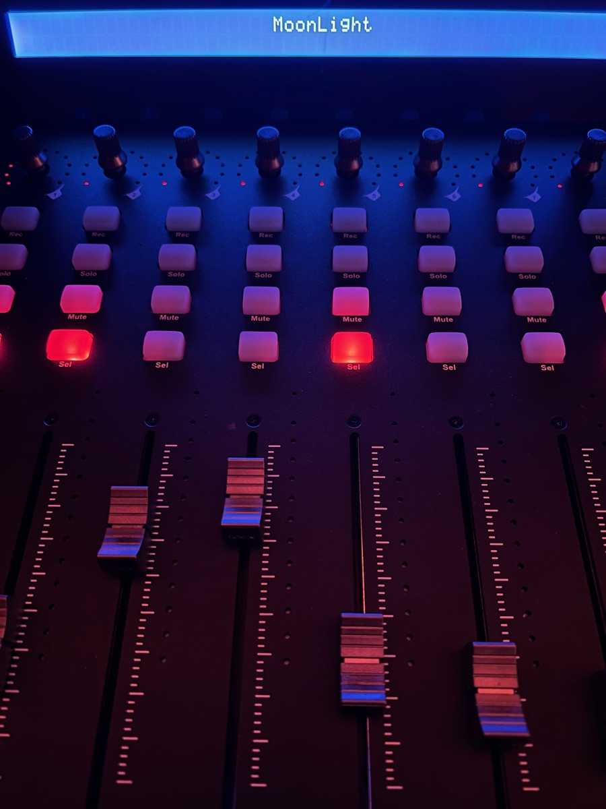

An APC40 mkII takes its power from USB, which this board's port does not supply, so it stays on the laptop or goes through an active, powered USB hub.

---

## 9. Updating devices you cannot reach

Devices inside a sculpture are hard to reach with a cable, so update them over the network and check before you send.

- Compare the new image's size with the `partition` total on the device's Firmware card.
- A device with two app slots takes `POST /api/firmware/upload` directly.
- A device with 4 MB of flash has one app slot. `POST /api/firmware/moonbase` restarts it into MoonBase, its recovery image, which takes the upload and restarts into the new firmware ([updating firmware](updating-firmware.md)).
- Update one device, see it run, then the next.

---

## 10. The network

The StadBeest brings its own network: a GL.iNet Slate AX (GL-AXT1800) travel router.
Every device joins its WiFi, and the audio source is wired to it by Ethernet, so the beast runs the same at every venue.

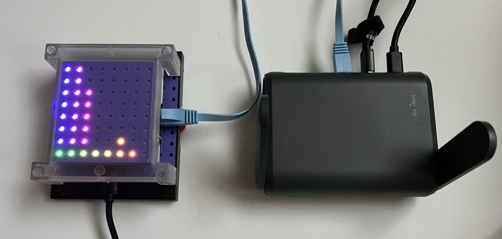

| Device | Board | Address | Connection | Role |
|---|---|---|---|---|
| MM-StadBeest | LightCrafter 16 (ESP32-S3) | 192.168.1.103 | WiFi | the legs, the leader |
| MM-eye1 | ESP32-S3-Zero | 192.168.1.149 | WiFi | an eye |
| MM-Eye2 | ESP32-S3-Zero | 192.168.1.216 | WiFi | an eye |
| MM-bulb1 | ESP32-C3 RGBWW PWM bulb | 192.168.1.230 | WiFi | the mouth |
| MM-bulb2 | ESP32-C3 RGBWW PWM bulb | 192.168.1.215 | WiFi | the backup mouth, set up as MM-bulb1 |
| MM-S31 | ESP32-S31 CoreBoard | 192.168.1.125 | Ethernet, 1 Gbit | the audio source |
| MM-MIDI-rtp | ESP32-S3 (N16R8) | 192.168.1.101 | WiFi | the MIDI bridge |

| What travels | From, to | How |
|---|---|---|
| Audio | the S31 to every device | WLED audio sync, multicast `239.0.0.1`, port 11988 |
| Shared controls | the leader to the eyes | OSC, multicast `239.255.77.78`, port 9001 |
| The desk | the bridge and the leader | RTP-MIDI, unicast, port 5004 |
| Discovery | every device | multicast and broadcast |

Two router settings keep it steady:

- **IGMP snooping off** (Network, IGMP Snooping).
  A router that snoops without asking members again forgets them: on the Slate AX a board lost the group 18 seconds after joining it.
  The audio then stopped every 20 seconds, and an eye missed the leader's palette changes.
  With a few small streams on a dedicated network, sending multicast to every device costs nothing worth saving.
- **An address reservation per device** (Network, LAN), so the addresses above stay the same.
  The leader's MIDI `host` is the bridge's address, and a host setting also takes a name, but a name resolves by mDNS, which is multicast again.

A device that stops hearing a group joins it again after 3 seconds of silence, so a network that drops multicast now and then recovers on its own.
For a stream on a network you do not control, unicast is the reliable choice: each copy is acknowledged and retried, where multicast goes out unacknowledged at the slowest rate.
Set the source's Audio `addressing` to `unicast` with the devices in `hosts`; the same holds for Art-Net, E1.31 and DDP from [Network Send](../moonmodules/light/drivers.md#networksend).

---

## The text next to the beast

The card beside the StadBeest at the Museumnacht, in Dutch and English, with a QR code to the guide.

> **Het Stad Beest ontwaakt**
>
> Dit beest is gemaakt van wat de stad wegdoet.
> Zijn lijf is een kroonluchter, zijn nek zijn buigzame lamparmen uit de kringloopwinkel, en zijn ogen zitten in 3D-geprinte gloeilampen.
> Vanavond wordt het wakker.
> Het loopt op tien poten van licht, steeds een paar tegelijk, zoals een echt dier.
> Het hoort de muziek: op de beat zet het een stap, kijkt het om zich heen en flitst het.
> Hoe harder de muziek, hoe hoger het zijn poten optilt en hoe wijder zijn pupillen worden.
>
> Niemand bestuurt het.
> Elke paar minuten kiest het zelf nieuwe kleuren en een nieuwe stemming, van rustig tot wild.
> Drie kleine computers praten via wifi met elkaar, zodat poten en ogen samen één beest zijn.
> Ze draaien op MoonLight, open-source lichtsoftware van vrijwilligers: iedereen kan er zelf zo'n beest mee bouwen.
>
> Scan de code om te zien hoe het gemaakt is en om contact met ons op te nemen.
>
> *Door Ewoud Wijma - MoonModules*

> **The City Beast awakens**
>
> This beast is made of what the city throws away.
> Its body is a chandelier, its neck is bendable lamp arms from a second-hand shop, and its eyes sit in 3D-printed light bulbs.
> Tonight it wakes up.
> It walks on ten legs of light, a few at a time, like a real animal.
> It hears the music: on the beat it takes a step, looks around and flashes.
> The louder the music, the higher it lifts its legs and the wider its pupils grow.
>
> Nobody steers it.
> Every few minutes it picks new colors and a new mood of its own, from calm to wild.
> Three small computers talk over WiFi, so its legs and eyes move as one beast.
> They run MoonLight, open-source lighting software made by volunteers: anyone can build a beast like this.
>
> Scan the code to see how it is made and to get in touch with us.
>
> *By Ewoud Wijma - MoonModules*
