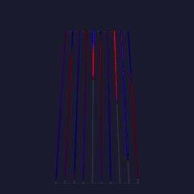
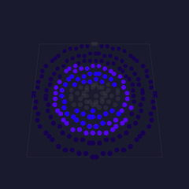

# Building a multi-board installation

> Saw the StadBeest at the Museumnacht? [Leave a message](https://tally.so/r/68X5xO), or join us on [Discord](https://discord.gg/TC8NSUSCdV) or [Reddit](https://reddit.com/r/moonmodules).

An installation is several MoonLight boards that act as one piece: one creature, one sculpture, one room.
The worked example is the StadBeest, a walking beast whose legs and eyes run on three boards.
Each section names a choice that makes it work; borrow what fits your own piece.

<video src="../assets/how-to/multi-board/stadbeest.mp4" width="300" autoplay loop muted playsinline title="The StadBeest walking: ten glowing legs on a chandelier body and two ring-disc eyes"></video>

> New here? Start with **[Install & first light](../gettingstarted.md)** and **[your first script](../tutorials/first-script.md)**. What follows assumes boards that run MoonLight on one network.

---

## The StadBeest at a glance

| part | board | lights | layout | effect |
|---|---|---|---|---|
| legs | LightCrafter 16 (ESP32-S3 N8R8) | 10 SK6812 RGBW strips of 144 | Tubes, `tubeDistance` 7 | [`stadbeest-legs.mle`](https://github.com/MoonModules/MoonLight/blob/main/moonlive/effects/stadbeest-legs.mle) |
| left eye | ESP32-S3-Zero, 4 MB | a 241-light ring disc | Rings241 | [`stadbeest-eyes.mle`](https://github.com/MoonModules/MoonLight/blob/main/moonlive/effects/stadbeest-eyes.mle) |
| right eye | ESP32-S3-Zero, 4 MB | a 241-light ring disc | Rings241 | [`stadbeest-eyes.mle`](https://github.com/MoonModules/MoonLight/blob/main/moonlive/effects/stadbeest-eyes.mle) |

 

The legs board leads: its control surface holds the shared settings, and the eyes follow it over OSC.
Every board hears the same music through WLED audio sync, so all three step and blink on the same beat.
See it at the [Museumnacht Den Haag](https://museumnachtdenhaag.nl/programma/het-stad-beest-ontwaakt/), where it runs through the night as *Het Stad Beest ontwaakt*.

---

## How the StadBeest is made

The body is built on a chandelier, and the eyes ride on bendable lamp arms, both found in a second-hand store.
Each eye sits in a 3D-printed bulb body, shaped like a lamp with a screw base.
A printed top plate screws onto the body and holds the 241-light ring disc.

 

Each leg is a tube that holds one LED strip.
A printed connector joins the top of a tube to the chandelier, and a printed foot closes the bottom, with a slot for the strip's cable.

 

---

## 1. One board per part

Give each physical part its own board and its own layout, sized to that part.
A part then keeps its own frame rate, effect and brightness limits.
A failing board takes down one part rather than the piece.
The layout decides what an effect can show: the legs are ten vertical strips, the eyes are nine concentric rings, and each effect is written for exactly that shape.

 

The legs run on a LightCrafter 16, a 16-channel LED driver board with Ethernet, using ten of its channels.
Each eye runs on an ESP32-S3-Zero, small enough to fit inside the printed bulb.

 

---

## 2. Effects written for the hardware

Both StadBeest effects are [MoonLive](../moonmodules/light/moonlive.md) scripts, and most of what makes them read well is design rather than code.

 

**Draw for the medium.**
A ring disc has nine rings, from one light in the center to sixty at the edge.
So the eye is built from ring zones: a dark pupil, a palette iris, a dim rim.
Fine detail such as iris fibers or a thin slit pupil disappears at that resolution.

**Move few things at once.**
In a real walk most legs stand still while one or two lift.
The legs effect keeps every leg lit and standing, and lifts each one briefly in a wave from back to front, the two sides half a cycle apart.
A creature reads as alive when the eye can follow what moves.

**Tie color to movement.**
A standing leg holds its colors, a lifting leg carries them up with its foot, and each step moves the palette on a quarter.
The eye's colors move on with each dart of its gaze.
Color that drifts on its own competes with the motion instead of showing it.

**Listen to the right signal.**

- `audioBeat()` for timing: the legs step and the eyes dart on the beat.
- `audioSmooth()` for size: louder music lifts the legs higher and widens the pupil.
- A flash on the beat that fades over half a second, for brightness.

The raw frequency bands change every frame, and driven straight into brightness or height they look random.

**Let two boards agree without talking.**
The eyes pick each dart's direction from `audioPeakHz()` at the beat, which both boards read the same.
So they look the same way at the same moment, with no message between them.

**Use them yourself.**
The legs, the eyes and the autopilot are part of MoonLight's [script library](https://github.com/MoonModules/MoonLight/tree/main/moonlive).
Every device running MoonLight lists them in its script picker and downloads one when it is chosen.
The full code: [`stadbeest-legs.mle`](https://github.com/MoonModules/MoonLight/blob/main/moonlive/effects/stadbeest-legs.mle), [`stadbeest-eyes.mle`](https://github.com/MoonModules/MoonLight/blob/main/moonlive/effects/stadbeest-eyes.mle) and [`stadbeest-autopilot.mls`](https://github.com/MoonModules/MoonLight/blob/main/moonlive/services/stadbeest-autopilot.mls); to write your own, start with [your first script](../tutorials/first-script.md).

---

## 3. Iterate on the board

A script is a file, so the fastest loop is to edit it where it runs.

1. Write it to the board: `curl -X POST -H "Expect:" --data-binary @legs.mle "http://<board>/api/file?path=/moonlive/stadbeest-legs.mle"`.
2. Read the effect's status on its card or in `/api/state`: a compile error shows there with its position.
3. Judge it on the real lights, then change one thing.

A file in `/moonlive` shadows the factory script of the same name, so the board runs your copy until you delete it ([scripts on a device](../reference/integrating.md)).
A script that does not compile leaves its effect dark, so keep the last working version at hand and upload it back before you walk away.

---

## 4. One surface layout for every board

Each board's [Control](../moonmodules/core/system.md#control) card is a desk of eight faders, eight encoders and eight switches, and each slot is assigned to one control by name, such as `stadbeest-legs.bpm`.

Use one slot layout across the whole installation: a slot means the same thing on every board where it applies.
A board with nothing for a slot leaves it unassigned.

| slot | legs board | each eye |
|---|---|---|
| `switch1` | `Drivers.on` | `Drivers.on` |
| `switch2` | legs `pulse` | eye `pulse` |
| `switch8` | autopilot `run` | |
| `fader1` | `Drivers.brightness` | `Drivers.brightness` |
| `fader2` | legs `bpm` | eye `bpm` |
| `fader3` | legs `sensitivity` | eye `sensitivity` |
| `fader4` | legs `swing` | |
| `fader5` | legs `lift` | |
| `fader6` | legs `stand` | |
| `encoder1` | `Drivers.palette` | `Drivers.palette` |
| `encoder2` | | eye `pupil` |
| `encoder3` | | eye `look` |
| `encoder4` | | eye `blink` |

A slot holds the value of the control it drives, so `fader2` at 33 means `bpm` 33, and assigning a slot changes nothing until the slot moves.
Assign from the card, or with `POST /api/control` and `{"module":"Control","control":"fader2Target","value":"stadbeest-legs.bpm"}`.

---

## 5. Linking the boards with OSC

The [OSC](../moonmodules/core/services.md#osc) service mirrors a surface to the network, which is all the linking an installation needs.

 

**The leader** (the legs board): OSC `feedback` on, `addressing` multicast, `group` the default `239.255.77.78`, `feedbackPort` 9001.
Every slot that changes on the leader, from its card, a preset, a script or a desk, goes out as `/mm/fader/N`, `/mm/encoder/N` or `/mm/switch/N`.

**The followers** (the eyes): an OSC service with `listen` on and `port` 9001, the leader's `feedbackPort`, and `feedback` off.
A follower joins the group, writes each message onto its own slot N, and its assignments carry the value to its own controls.

Three details matter:

- The followers listen on 9001 and the leader on 9000, so the leader never hears its own feedback, and a follower never answers back.
- A follower takes a value when the leader's slot changes, and the leader sends every slot again every 30 seconds. A value lost on WiFi, or a follower that rebooted, is repaired within that time.
- WiFi multicast drops packets that arrive in a burst, so the leader sends that refresh one slot at a time.
  A writer on the leader spreads its own changes the same way.

---

## 6. One source of music

Every board runs the [Audio](../moonmodules/core/services.md#audio) service in receive mode, and one machine sends WLED audio sync to all of them.
That machine is a board with a microphone, or a computer running MoonLight that captures what it plays.
One source means one beat: the legs step, the eyes dart and every flash lands on the same moment.

---

## 7. Running unattended

A [MoonLiveService](../moonmodules/core/services.md#moonliveservice) on the leader runs [`stadbeest-autopilot.mls`](https://github.com/MoonModules/MoonLight/blob/main/moonlive/services/stadbeest-autopilot.mls), which plays the beast through a whole museum night without anyone at the desk.

- **Scenes:** every `minutes` it picks a new scene: a palette from the vivid ones, a mood from calm to wild, `pulse` on or off, and the eyes' pupil size and blink rate.
- **Breathing:** within a scene the energy rises and falls once a minute, spread over the legs' tempo, swing and lift and how far the eyes look.
- **Through the surface:** it writes the shared slots with `setControl("fader2", value)`, so the legs follow on the leader and the eyes over OSC, exactly as when a person moves a fader.
- **One slot at a time:** it writes one slot every 20 ms, every ten seconds, so no burst reaches the network.
- **Handing over:** its `run` switch sits on `switch8`; off gives the beast back to people and desks.

---

## 8. Driving it by hand: an Akai APC40 mkII

A desk on the leader moves the whole installation, since its changes go out over OSC like any other.
The StadBeest takes an [Akai APC40 mkII](../reference/hardware/control-surfaces.md#akai-apc40-mkii): faders, knobs and buttons for the shared slots, and a pad per preset.

**Setting it up**

1. On the leader, add a **MIDI** service under **Services** and set its `profile` to `Akai APC40 mkII`.
2. Plug the APC40 into a laptop next to the beast, and open the leader's page in Chrome.
3. Mark the leader's address as secure in Chrome once, as [MIDI, details](../moonmodules/core/services.md#midi-details) shows, since a board's own page is plain `http`.
4. Allow MIDI, with SysEx, when Chrome asks. The desk lights up: the knob rings, the activator lights and the preset pads.

The browser is the bridge between desk and board, so the laptop keeps the leader's page open while the desk is in use.

**Playing it**

| APC40 | the StadBeest |
|---|---|
| track faders 1-6 | brightness, then the legs' `bpm`, `sensitivity`, `swing`, `lift` and `stand` |
| track knobs 1-4 | the palette, then the eyes' `pupil`, `look` and `blink` |
| activator 1 | on and off |
| activator 2 | `pulse`, legs and eyes together |
| activator 8 | the autopilot's `run` |
| clip pads | the presets, the top-left pad being preset 1; a stored preset glows white and the applied one green |

The autopilot rewrites the shared slots every ten seconds, so switch it off with activator 8 before playing by hand, and on again to hand the beast back.
The eyes follow every move over OSC, as they follow the autopilot.
A phone or a tablet reaches the same slots too: [connecting a control surface](control-surface.md).

---

## 9. Updating boards you cannot reach

Boards inside a sculpture are hard to reach with a cable, so update them over the network and check before you send.

- Compare the new image's size with the `partition` total on the board's Firmware card.
- A board with two app slots takes `POST /api/firmware/upload` directly.
- A 4 MB board has one app slot: `POST /api/firmware/moonbase` restarts it into MoonBase, its recovery image, which then takes the upload and restarts into the new firmware ([updating firmware](updating-firmware.md)).
- Update one board, see it run, then the next.

---

## The text next to the beast

The card beside the StadBeest at the Museumnacht, in Dutch and English, with a QR code to the guide.

> **Het Stad Beest ontwaakt**
>
> Dit beest is gemaakt van wat de stad wegdoet.
> Zijn lijf is een kroonluchter, zijn nek zijn buigzame lamparmen uit de kringloopwinkel, en zijn ogen zitten in 3D-geprinte gloeilampen.
> Vanavond wordt het wakker.
> Het loopt op tien poten van licht, steeds een paar tegelijk, zoals een echt dier.
> Het hoort de muziek: op de beat zet het een stap, kijkt het om zich heen en flitst het.
> Hoe harder de muziek, hoe hoger het zijn poten optilt en hoe wijder zijn pupillen worden.
>
> Niemand bestuurt het.
> Elke paar minuten kiest het zelf nieuwe kleuren en een nieuwe stemming, van rustig tot wild.
> Drie kleine computers praten via wifi met elkaar, zodat poten en ogen samen één beest zijn.
> Ze draaien op MoonLight, open-source lichtsoftware van vrijwilligers: iedereen kan er zelf zo'n beest mee bouwen.
>
> Scan de code om te zien hoe het gemaakt is en om contact met ons op te nemen.
>
> *Door Ewoud Wijma - MoonModules*

> **The City Beast awakens**
>
> This beast is made of what the city throws away.
> Its body is a chandelier, its neck is bendable lamp arms from a second-hand shop, and its eyes sit in 3D-printed light bulbs.
> Tonight it wakes up.
> It walks on ten legs of light, a few at a time, like a real animal.
> It hears the music: on the beat it takes a step, looks around and flashes.
> The louder the music, the higher it lifts its legs and the wider its pupils grow.
>
> Nobody steers it.
> Every few minutes it picks new colors and a new mood of its own, from calm to wild.
> Three small computers talk over WiFi, so its legs and eyes move as one beast.
> They run MoonLight, open-source lighting software made by volunteers: anyone can build a beast like this.
>
> Scan the code to see how it is made and to get in touch with us.
>
> *By Ewoud Wijma - MoonModules*
