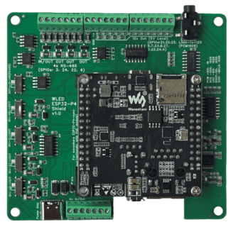

# IO Module

The IO module defines the **hardware identity** of your ESP32 device — which board it is, what pins do what, and how much power to allow. It is the foundation that all other modules and nodes build on: LED drivers read pin assignments from here, ethernet is configured here, I2C peripherals are discovered here.

---

## Board Preset

A dropdown listing all supported boards. Selecting a preset auto-configures **all pins**, **max power**, **ethernet type**, and **switches** to match the board's hardware layout.

Currently supported boards:

| Board | MCU | Max Power | Ethernet | Notes |
|---|---|---|---|---|
| QuinLED Dig-2-Go | ESP32-D0 | 10 W | — | USB powered, ships with GRBW strip |
| QuinLED Dig-Next-2 | ESP32-D0 | 65 W | — | 2 LED outputs, 4 relay pins |
| QuinLED Dig-Uno v3 | ESP32-D0 | 50 W | — | 2 LED outputs |
| QuinLED Dig-Quad v3 | ESP32-D0 | 150 W | — | 4 LED outputs |
| QuinLED Dig-Octa v2 | ESP32-D0-16MB | 400 W | LAN8720 (RMII) | 8 LED outputs, onboard ethernet |
| Olimex ESP32-POE | ESP32-D0 | — | LAN8720 (RMII) | PoE board, onboard ethernet, GPIO12 power pin |
| Serg Universal Shield | ESP32-D0 | 50 W | — | IR, relay, mic, I2C |
| Serg Mini Shield | ESP32-D0 | 50 W | — | Compact, mic, I2C |
| SE16 v1 | ESP32-S3 | 500 W | W5500 (SPI) | 16 LED outputs, Switch1: IR / Ethernet |
| LightCrafter16 | ESP32-S3 | 500 W | W5500 (SPI) | 16 LED outputs, RS-485, voltage/current |
| MHC V43 controller | ESP32-D0 | 75 W | — | 4 LED outputs, mic |
| MHC V57 PRO | ESP32-D0 | 75 W | — | 4 LED outputs, relay |
| MHC P4 Nano Shield V1.0 | ESP32-P4 | 100 W | — | Up to 16 LED outputs, mic/line-in |
| MHC P4 Nano Shield V2.0 | ESP32-P4 | 100 W | — | Up to 16 LED outputs, I2C, mic/line-in |
| Atom S3R | ESP32-S3 | 10 W | — | 4 LED outputs |
| Luxceo Mood1 Xiao Mod | ESP32 | 50 W | — | 3 LED outputs, PIR sensor |

> **Tip:** If your board is not listed, select the default preset (your build target) and manually assign pins. This sets the **modded** flag automatically.

---

## Modded

A checkbox that tracks whether the pin configuration has been **manually customised**. It is set automatically when you change any pin assignment or max power.

- **On** — custom configuration; changing the board preset will *not* overwrite your pins
- **Off** — using board defaults; selecting a different preset or toggling switches will reload the preset defaults

To return to factory defaults for the current board: turn **modded** off.

---

## Max Power

| Control | Type | Range | Default |
|---|---|---|---|
| **maxPower** | Number | 0–500 W | 10 W |

Sets the maximum power budget in Watts. The LED driver automatically limits brightness to stay within this envelope, based on the number of LEDs configured.

The default of **10 W** (5 V × 2 A) is safe for USB power supplies. Increase this to match your actual power supply — for example, a 5 V / 40 A supply = 200 W.

Used by LED drivers; see [Drivers](../moonlight/drivers.md).

---

## Pins

The pin table lists every GPIO on the chip with its current assignment. Pins with usage "Unused" are hidden by default — use the filter to show all.

Each pin row shows:

| Column | Description |
|---|---|
| **GPIO** | GPIO number (read-only) |
| **Usage** | What the pin is used for — see [Pin types](#pin-types) below |
| **Index** | Order within a usage type (e.g. LED D01, D02, …, D16) |
| **Summary** | Capability flags: ✅ Valid, 💡 Output capable, ⏰ RTC GPIO |
| **Level** | Current logic level: HIGH, LOW, or N/A |
| **DriveCap** | Drive strength: WEAK, STRONGER, MEDIUM, STRONGEST, or N/A |

Changing any pin assignment or index sets the **modded** flag.

---

## Pin Types

### LED Outputs

| Pin type | Description |
|---|---|
| **LED** 🚦 | Digital addressable LED data pin (WS2812B, SK6812, etc.) |
| **LED CW** | Cold white PWM channel |
| **LED WW** | Warm white PWM channel |
| **LED R / G / B** | Individual red / green / blue PWM channels |

Used by LED drivers to set up outputs. See [Drivers](../moonlight/drivers.md).

### Audio (I2S)

| Pin type | Description |
|---|---|
| **I2S SD** | Serial data (microphone or line-in input) |
| **I2S WS** | Word select (left/right channel clock) |
| **I2S SCK** | Serial clock |
| **I2S MCLK** | Master clock (not always required) |

### I2C

| Pin type | Description |
|---|---|
| **I2C SDA** 🔌 | I2C data line |
| **I2C SCL** 🔌 | I2C clock line |

When both SDA and SCL are assigned, the I2C bus is initialised and peripherals are scanned automatically. See [I2C peripherals](#i2c-peripherals) below.

### Buttons & Relays

| Pin type | Description |
|---|---|
| **Button** 🛎️ | Momentary push button (active-low, debounced) |
| **Button** 𓐟 | Toggle switch — any state change triggers |
| **Button LightOn** 🛎️ | Push button that toggles lights on/off in [Lights Control](../moonlight/lightscontrol.md) |
| **Button LightOn** 𓐟 | Toggle switch that toggles lights on/off |
| **Relay** | General-purpose relay output |
| **Relay LightOn** 🔀 | Relay driven by the lights on/off state |

### Energy Monitoring

| Pin type | Description |
|---|---|
| **Voltage** ⚡️ | ADC input for voltage measurement |
| **Current** ⚡️ | ADC input for current measurement |
| **Battery** | ADC input for battery voltage |

See [System Status](../system/status.md) and [System Metrics](../system/metrics.md).

### Ethernet

| Pin type | Description |
|---|---|
| **Ethernet** | Reserved RMII data pins (hardwired in silicon) |
| **SPI SCK** 🔗 | SPI clock — for W5500 ethernet |
| **SPI MISO** 🔗 | SPI data in — for W5500 ethernet |
| **SPI MOSI** 🔗 | SPI data out — for W5500 ethernet |
| **PHY CS** 🔗 | SPI chip select — for W5500 ethernet |
| **PHY IRQ** 🔗 | Interrupt from ethernet PHY (optional) |
| **ETH MDC** 🔗 | Management Data Clock — RMII PHY register access |
| **ETH MDIO** 🔗 | Management Data I/O — RMII PHY register read/write |
| **ETH CLK** 🔗 | RMII 50 MHz reference clock to/from PHY |
| **ETH PWR** 🔗 | PHY power enable GPIO |

### Communication

| Pin type | Description |
|---|---|
| **Infrared** ♨️ | IR receiver input. Used by IR driver, see [Drivers](../moonlight/drivers.md) |
| **DMX in** | DMX512 input (planned) |
| **RS-485 TX / RX / DE** | RS-485 half-duplex UART — all three must be assigned for initialisation |
| **Serial TX / RX** | UART serial pins |

### Sensors

| Pin type | Description |
|---|---|
| **PIR** ♨️ | Passive infrared motion sensor — HIGH = lights on, LOW = lights off |
| **Temperature** | Temperature sensor input (planned) |

### System & Utility

| Pin type | Description |
|---|---|
| **High** | Set GPIO permanently HIGH |
| **Low** | Set GPIO permanently LOW |
| **Onboard LED** | Board's built-in indicator LED |
| **Onboard Key** | Board's built-in button |
| **Digital Input** | General-purpose digital input (may have protection circuit) |
| **Exposed** | Header pin available for external use |
| **Reserved** | Pin reserved by other subsystem (USB, WiFi coprocessor, etc.) |
| **SDIO CMD / CLK / D0–D3** | SDIO interface (used by ESP-Hosted WiFi coprocessor on P4) |

---

## I2C Peripherals

When both I2C SDA and SCL pins are assigned, the bus is initialised and a scan runs automatically. Discovered devices appear in a table:

| Column | Description |
|---|---|
| **Address** | Hex address of the peripheral (e.g. 0x68) |
| **Name** | Device name — shows "unknown" until a driver identifies it |
| **ID** | Device ID — shows "unknown" until a driver provides it |

A driver node (e.g. the [IMU driver](../moonlight/drivers.md#driver-nodes)) will fill in the name and ID when added.

The **I2C frequency** can be adjusted (default 100 kHz). Higher frequencies (400 kHz) are faster but may not work with all peripherals or cable lengths.

---

## Switches

Two board-specific toggle switches that select between alternate pin configurations. What each switch does depends on the board preset:

| Board | Switch1 | Switch2 |
|---|---|---|
| **MHC P4 Nano Shield V1.0** | Off: 16 LED pins (default). On: 8 LED + RS-485 + digital inputs | Off: onboard mic (I2S). On: line-in audio |
| **MHC P4 Nano Shield V2.0** | Off: 16 LED pins (default). On: 8 LED + RS-485 + digital inputs | Off: onboard mic (I2S). On: line-in audio |
| **SE16 v1** | Off: infrared (default). On: ethernet (W5500 SPI) | — |
| **Serg Universal Shield** | Selects second LED pin (GPIO 1 or GPIO 3) | — |

Toggling a switch **does not** set the modded flag — it reloads the board preset with the new switch position applied.

---

## Ethernet Type

| Control | Type | Options |
|---|---|---|
| **ethernetType** | Select | Board Default, LAN8720 (RMII), W5500 (SPI) |

Selects the ethernet hardware type. This is typically set automatically by the board preset but can be changed manually.

| Type | Interface | Chips | Available on |
|---|---|---|---|
| **Board Default** | Compile-time pins | Varies | Boards with ethernet defined in `pins_arduino.h` |
| **LAN8720 (RMII)** | Built-in EMAC | LAN8720A | ESP32-D0, ESP32-P4 |
| **W5500 (SPI)** | External SPI module | W5500, WIZ850IO | All targets |

**Board Default** uses the pin definitions baked into the board variant at compile time (via `pins_arduino.h`). No runtime pin assignment is needed — `ETH.begin()` is called with no arguments and the framework resolves the pins automatically. This is used by boards like the ESP32-P4-ETH where ethernet pins are fixed by the hardware design. If the board variant does not define ethernet pins, this option has no effect.

**LAN8720 (RMII)** requires **ETH MDC**, **ETH MDIO**, and **ETH CLK** pins to be assigned. The six RMII data pins (TXD0, TX_EN, TXD1, RXD0, RXD1, CRS_DV) are hardwired in silicon and are reserved as **Ethernet** pin type.

**W5500 (SPI)** requires **SPI SCK**, **SPI MISO**, **SPI MOSI**, and **PHY CS** pins to be assigned. **PHY IRQ** is optional.

See [Ethernet settings](../network/ethernet.md) for hostname and IP configuration.

---

## PHY Address

| Control | Type | Range | Default |
|---|---|---|---|
| **ethPhyAddr** | Number | 0–31 | 0 |

The MDIO address of the ethernet PHY chip on the RMII bus. Only applies to **LAN8720 (RMII)** mode.

Most LAN8720A boards use address **0**. Some modules use address **1** (for example, certain bare LAN8720 breakout modules). Check your board's datasheet if ethernet does not initialise. Board presets set the correct value automatically.

---

## PHY Clock Mode

| Control | Type | Options | Default |
|---|---|---|---|
| **ethClkMode** | Select | GPIO0 IN, GPIO0 OUT, GPIO16 OUT, GPIO17 OUT | GPIO17 OUT |

Selects how the 50 MHz RMII reference clock is routed. Only applies to **LAN8720 (RMII)** mode.

| Option | Direction | When to use |
|---|---|---|
| **GPIO0 IN (ext clock from PHY)** | PHY → ESP32 | The PHY chip generates the 50 MHz clock and feeds it into GPIO0. Used by Olimex ESP32-POE (WROVER variant) and similar boards where the LAN8720 is the clock source. |
| **GPIO0 OUT** | ESP32 → PHY | ESP32 outputs the clock on GPIO0. Less common — GPIO0 is a strapping pin so this is rarely used in new designs. |
| **GPIO16 OUT** | ESP32 → PHY | ESP32 outputs the clock on GPIO16. Used by some bare LAN8720 breakout modules. |
| **GPIO17 OUT** | ESP32 → PHY | ESP32 outputs the clock on GPIO17. Most common for WROOM-based boards including QuinLED Dig-Octa and Olimex ESP32-POE (WROOM variant). **Default.** |

Board presets set the correct value automatically.

!!! warning "GPIO0 is a strapping pin"
    When using **GPIO0 IN**, the PHY drives GPIO0 at boot. Ensure your hardware design keeps this pin at the correct strapping level before the ESP32 samples it during reset, or the device may boot into flash mode.

---

## Naming Convention

| Term | Abbreviation | Meaning |
|---|---|---|
| MicroController | MCU | The ESP32 chip (D0, S3, P4, …) |
| MCU-Board | MCB | MCU on a PCB (e.g. ESP32-DevKitC, ESP32-S3-N8R8) |
| Carrier Board | CRB | Board that the MCU-board plugs into (shield / controller) |
| Device | DVC | Complete assembly in a case with connectors |

---

## Board Details

### QuinLED Boards

#### Dig-2-Go, Dig-Uno, Dig-Quad

{: style="width: 200px"}
{: style="width: 200px"}
{: style="width: 200px"}

* [Dig-2-Go](https://quinled.info/quinled-dig2go/), [Dig-Uno](https://quinled.info/pre-assembled-quinled-dig-uno/), [Dig-Quad](https://quinled.info/pre-assembled-quinled-dig-quad/): Choose the esp32-d0 (4MB) board in the [MoonLight Installer](../gettingstarted/installer.md)
    * Dig-2-Go: Shipped with a 300 LED, GRBW led strip: Choose layout with 300 lights (e.g. Single Column for 1D, Panel 15x20 for 2D). Select Light preset GRBW in the LED Driver.
    * Currently no OTA support on ESP32-D0 boards: Dig-2-Go, Uno, Quad.

#### Dig-Next-2

{: style="width: 200px"}

* [Dig-Next-2](https://quinled.info/dig-next-2): Choose the esp32-d0-pico2 board in the [MoonLight Installer](../gettingstarted/installer.md)

#### Dig-Octa

{: style="width: 200px"}

* [Dig-Octa](https://quinled.info/quinled-dig-octa/): Choose the esp32-d0-16mb board in the [MoonLight Installer](../gettingstarted/installer.md)
* On first install, erase flash first (Especially when other firmware like WLED was on it) as MoonLight uses a partition scheme with 3MB of flash
* After install, select the QuinLED board preset to have the pins assigned correctly.
* Features onboard LAN8720A ethernet — automatically configured by the board preset (ethernetType = LAN8720, ethPhyAddr = 0, ethClkMode = GPIO17 OUT, RMII pins assigned)

!!! warning "GPIO 1 and GPIO 3 — UART0 TX/RX"
    The Dig-Octa routes **GPIO 1** (UART0 TX) and **GPIO 3** (UART0 RX) to two of its eight LED outputs. These pins are shared with the USB-serial interface used for flashing and serial monitoring.

    When used as LED pins, MoonLight automatically suppresses UART0 output (both `Serial` and ESP-IDF logging) to prevent the LED driver and UART driver from fighting over the pin, which would cause serial noise and eventual watchdog crashes.

    However, the USB-serial chip is **hardwired** to GPIO 1/3 — so the serial monitor will still show garbage characters (`>>>?>>>...`) as it interprets the LED data signal as serial data. This is electrical, not a software bug — there is no way to prevent it.

    **Consequences of using GPIO 1/3 as LED pins:**

    - All serial debug output is lost (logging is suppressed)
    - Serial monitor shows garbage from LED data on the TX pin
    - You lose the ability to diagnose issues via serial

    The board preset marks GPIO 1 and 3 as **Reserved** by default. If you need all 8 outputs, you can manually reassign them to LED — but be aware of the trade-offs above.

!!! tip "Reset router"
    You might need to reset your router if you first run WLED on the same board and no new IP is assigned.

### MyHome-Control

#### MHC ESP32-P4 shield

{: style="width: 200px"}

* See [MHC ESP32-P4 shield](https://shop.myhome-control.de/en/ABC-WLED-ESP32-P4-shield/HW10027). Choose the esp32-p4-nano board in the [MoonLight Installer](../gettingstarted/installer.md)
* On new ESP32-P4 Nano boards, the WiFi coprocessor needs to be updated first to a recent version, currently ESP-Hosted v2.0.17, see the link in the [MoonLight Installer](../gettingstarted/installer.md)
* After install, select the **MHC P4 Nano Shield V1.0** board preset to have the pins assigned correctly.
    * Assuming 100W LED power; change if needed.
    * Switch1: (also set the switches on the board)
        * off (default): 16 LED pins.
        * On: 8 LED pins, 4 RS-485 pins and 4 exposed pins
    * Switch2:
        * off (default): Pins 10, 11, 12, 13 used for build-in Mic over I2S, pin 7 and 8: I2C SDA and SCL
        * On: Pins 33, 25, 32, 36 used for Line in, pin 7 and 8: additional LED pins.
* Add the Parallel LED Driver, see [Drivers](../moonlight/drivers.md). It uses [@troyhacks](https://github.com/troyhacks) his parallel IO driver to drive all LED pins configured for the shield.

#### MHC V57 PRO

{: style="width: 200px"}

* See [MHC V57 PRO](https://shop.myhome-control.de/en/ABC-WLED-controller-PRO-V57-with-iMOSFET/HW10030). Choose the esp32-d0-pico2 board in the [MoonLight Installer](../gettingstarted/installer.md)

### StephanElec

#### SE16 v1

{: style="width: 200px"}

* Choose the esp32-s3-n8r8v board in the [MoonLight Installer](../gettingstarted/installer.md)
* Set Switch1 the same as you set the jumper on the board: off / default: Infrared. on: Ethernet.
* Only 5 boards were ever produced. If you are one of the lucky few, feel free to reach out to limpkin on [Discord](https://discord.gg/TC8NSUSCdV)
* Use the [L_SE16.sc](https://github.com/MoonModules/MoonLight/blob/main/livescripts/Layouts/L_SE16.sc) Live Script layout for this board. Controls: `mirroredPins` (wiring mode), `pinsAreColumns` (axis orientation), `ledsPerPin` (LEDs per output).

### Olimex

#### ESP32-POE

* See [Olimex ESP32-POE](https://www.olimex.com/Products/IoT/ESP32/ESP32-POE/open-source-hardware). Choose the esp32-d0 board in the [MoonLight Installer](../gettingstarted/installer.md)
* After install, select the **Olimex ESP32-POE** board preset to have the pins assigned correctly.
* Features onboard LAN8720A ethernet with Power-over-Ethernet — automatically configured by the board preset.

Pin mapping set by the preset:

| GPIO | Usage | Notes |
|---|---|---|
| 12 | ETH PWR | LAN8720 reset/power control — **critical**, must be assigned |
| 17 | ETH CLK | 50 MHz clock output from ESP32 to PHY (GPIO17 OUT mode) |
| 18 | ETH MDIO | PHY register data |
| 23 | ETH MDC | PHY register clock |
| 19, 21, 22, 25, 26, 27 | Ethernet | RMII data pins (hardwired in silicon) |

!!! warning "Static IP — assign after flashing"
    If you want a static IP address, configure it in **Ethernet Settings** after the board is running. Due to how the ESP32 Ethernet stack works, the static IP is applied after `ETH.begin()` completes — this is handled correctly by MoonLight.

!!! note "WROVER variant"
    The Olimex ESP32-POE also exists in a WROVER variant. On that variant the reference clock comes **from** the LAN8720 into GPIO0 rather than being driven by the ESP32. If you have the WROVER variant, change **ethClkMode** to **GPIO0 IN (ext clock from PHY)** and assign GPIO0 as **ETH CLK** instead of GPIO17.

#### LightCrafter16

{: style="width: 200px"}

* Choose the esp32-s3-n8r8v board in the [MoonLight Installer](../gettingstarted/installer.md)
* Documentation to be soon published on [limpkin's website](https://www.limpkin.fr)
* Use the [L_LC16.sc](https://github.com/MoonModules/MoonLight/blob/main/livescripts/Layouts/L_LC16.sc) Live Script layout for this board. Controls: `pinsAreColumns` (axis orientation), `ledsPerPin` (LEDs per output).
