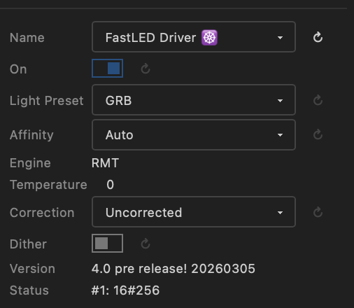
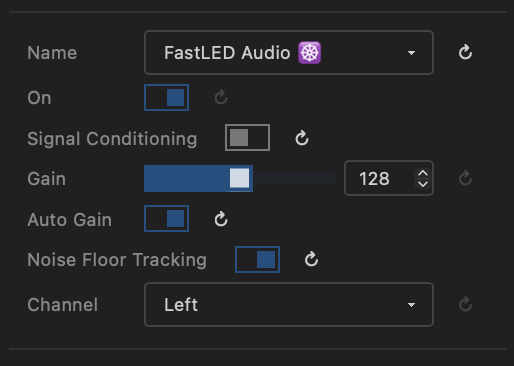
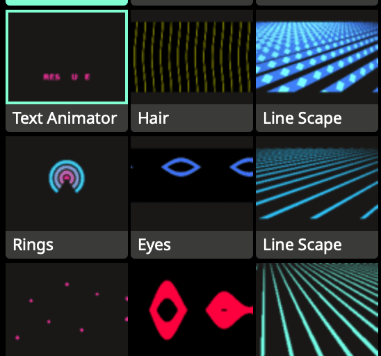
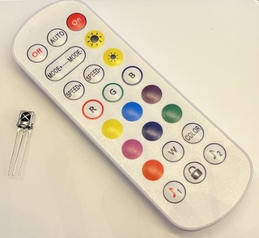
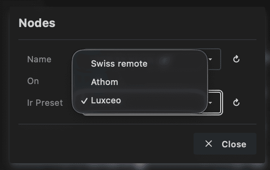
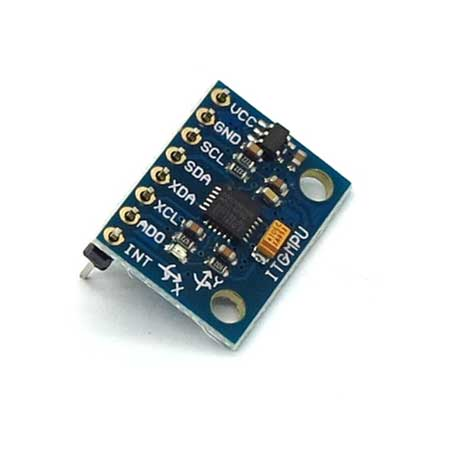
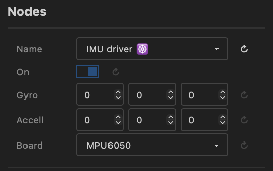

# Drivers module

## Overview

The Drivers module defines layers and drivers.

* Layout 🚥: A layout (🚥) defines the positions of the lights to control. See [Layouts](layouts.md)
* Driver ☸️: A driver is a link between MoonLight to hardware or the network. Drivers can both input data or output data. Examples:
    * LED drivers (FastLED, Parallel LED Drivers)
    * Light driver (Art-Net / DMX)
    * Audio driver
    * Sensor drivers (microphone, gyro, MIDI controller)

Layouts need to be defined before drivers as the driver takes the layouts defined before itself, e.g. to define which LEDs to drive on which pins.

## Controls

* Nodes: a list of Layouts and Drivers
    * Nodes can be added (+), deleted (🗑️) or edited (✎) or reordered (drag and drop). The node to edit will be shown below the list, press save (💾) if you want to preserve the change when the device is restarted
    * Reorder: Nodes can be reordered, defining the order of execution
        * Layouts: Need to be before drivers, multiple layouts can be added
        * Drivers: After Layouts, choose one LEDs driver and optionally add Network In/Out and WLED Audio, reordering might need a restart.
    * Controls. A node can be switched on and off and has custom controls, which defines the behaviour of the node 
    * See below for a list of existing Layouts and Drivers

## Driver ☸️ nodes

Below is a list of Drivers in MoonLight.
Want to add a Driver to MoonLight, see [develop](../develop/overview.md).

Custom layouts can also be created as **Live Scripts** — `.sc` files with an `onLayout()` function that define light positions and pin assignments. Any `.sc` file on the filesystem can be selected as a layout node. See [Live Scripts](livescripts.md) for details and examples.

| Name | Preview | Controls | Remarks
| ---- | ----- | ---- | ---- |
| Parallel LED Driver |  |  | Drive multiple LED types, all devices including ESP32-P4(-nano) supported Light preset: See below DMA buffer: set higher when LEDs flicker See [below](#parallel-led-driver) |
| FastLED Driver |  |  | Based on the FastLED Channels API to set Pins, Color order, Engine and other settings at runtime! Based on upcoming FastLED v4.0 ! See [Channels API](https://github.com/FastLED/FastLED/blob/master/src/fl/channels/README.md) |
| FastLED Audio |  |  | On-board microphone audio processing, allows audio-reactive effects (♪ & ♫) to use audio data (volume and bands (FFT)) and much more. Based on upcoming FastLED v4.0 ! see [FastLED Audio](https://github.com/FastLED/FastLED/blob/master/src/fl/audio/README.md) Connect a digital microphone (e.g. INMP441) to an ESP32 and setup the I2S pins in the [IO module](../moonbase/inputoutput.md)|
| Network Out |  | | Send pixel data over the network using Art-Net, DDP or E1.31/sACN. See [below](#network-out) |
| Network In |  | | Receive pixel data from the network (Art-Net, DDP or E1.31/sACN) e.g. from [Resolume](https://resolume.com/) or TouchDesigner. See [below](#network-in) |
| DMX Out | | | Send channel data to DMX fixtures over RS-485. See [below](#dmx-out) |
| DMX In | | | Receive DMX data from an external DMX controller via RS-485. See [below](#dmx-in) |
| WLED Audio |  | No controls | Listens to audio sent over the local network by WLED or WLED-MM and allows audio-reactive effects (♪ & ♫) to use audio data (volume and bands (FFT)) |
| HUB75 Driver |  |  | Drive HUB75 panels Not implemented yet |
| IR Driver |  |  | Receive IR commands and [Lights Control](lightscontrol.md) |
| IMU Driver |  |  | Receive inertial data from an IMU / I2C peripheral, see [IO](../moonbase/inputoutput.md#i2c-peripherals) Used in [particles effect](effects.md#moonlight-effects) |

### Light Preset

* **Max Power**: moved to [IO Module](../moonbase/inputoutput.md) board presets.

* **Light preset**: Defines the channels per light and color order

    

!!! warning "Same Light preset"
    Currently, if using multiple drivers, all drivers need the same Light preset !!

* RGB to BGR: 3 lights per channel, RGB lights, GRB is default
* GRBW: LEDs with white channel like SK6812.
* RGBW: for Par/DMX Lights
* GRB6: for LED curtains with 6 channels per light (only rgb used)
* RGBWYP: Compatible with [DMX 18x12W LED RGBW/RGBWUAV](https://s.click.aliexpress.com/e/_EJQoRlM) (RGBW is 4x18=72 channels, RGBWUAV is 6x18=104 channels). Currently setup to have the first 36 lights 4 channel RGBW, after that 6 channel RGBWYP ! Used for 18 channel light bars
* MH*: Moving Heads lights
    * MHBeTopper19x15W-32: [BeTopper / Big Dipper](https://betopperdj.com/products/betopper-19x15w-rgbw-with-light-strip-effect-moving-head-light)
    * MHBeeEyes150W-15: [Bee eyes](https://a.co/d/bkTY4DX)
    * MH19x15W-24: [19x15W Zoom Wash Lights RGBW Beam Moving Head](https://s.click.aliexpress.com/e/_EwBfFYw)

!!! info "Custom setup"
    These are predefined presets. In a future release custom presets will be possible.

### Parallel LED Driver

* The Parallel LED driver uses different hardware peripherals depending on the MCU type: ESP32-D0: I2S, ESP32-S3: LCD_CAM, ESP32-P4: Parallel IO (ParLIO).
* For ESP32-D0 and ESP32-S3 the [I2S clockless driver](https://github.com/hpwit/I2SClocklessLedDriver) is used
* For ESP32-P4 the [parlio driver](https://github.com/troyhacks/WLED) is used.
* Virtual LED Driver will be part of the Parallel LED driver: Driving max 120! outputs (E.g. 48 panels of 256 LEDs each run at 50-100 FPS) using shift registers. Integrated within the Parallel LED Driver architecture. Not implemented yet
  
    

**Parlio (ESP32-P4)**

*Created by @TroyHacks, extended by @ewowi*

The ESP32-P4 Parallel LED Driver uses the hardware PARLIO peripheral to control up to **16 LED strips simultaneously** with independent pixel counts per strip. This enables high-performance setups with thousands of LEDs while maintaining accurate timing through DMA-based transmission.

**Key Features:**

- **Variable LEDs per strip**: Each GPIO pin can drive a different number of WS2812/SK6812 LEDs (e.g., Pin 0: 100 LEDs, Pin 1: 50 LEDs, Pin 2: 120 LEDs)
- **Automatic padding**: Shorter strips receive black pixels to maintain timing alignment—no visual impact
- **Memory efficient**: Only stores actual LED data, padding happens during hardware transmission
- **High-speed operation**: Supports 800 kHz to 1.2 MHz clock speeds with auto-overclocking for smaller LED counts
- **RGB/RGBW support**: Configurable color ordering and per-component brightness correction
- **Configuration**: Assign GPIO pins in the MoonLight interface and specify LED counts per pin. The driver automatically calculates the maximum LEDs per pin and handles synchronization.

### Network Out ☸️

Sends pixel data over the network to LED controllers and DMX fixtures. Supports three protocols selectable at runtime — the port updates automatically when you switch protocol.

**Controls**

* **Light preset**: See [above](#light-preset).
* **Protocol**: Selects the output protocol:
    * **Art-Net** (port 6454) — industry-standard DMX-over-IP. Unicast or broadcast. An ArtSync packet is broadcast after each frame so all receivers display simultaneously.
    * **DDP** (port 4048) — lightweight pixel protocol. Unicast only; the push flag signals the last packet of each frame.
    * **E1.31 / sACN** (port 5568) — ANSI standard for streaming channel data. Unicast. Universes are 1-based, max 512 channels per universe.
* **Broadcast** *(Art-Net only)*: When enabled, sends to the subnet broadcast address (`x.x.x.255`) instead of specific IPs. All Art-Net receivers on the subnet pick up the data and select their own universes. The **Controller IPs** field is ignored.
* **Controller IPs** *(unicast only)*: The last segment(s) of the IP address(es) of the network controllers. Use a comma-separated list (`11,12,13`) or a hyphen for a range (`11-20`). Pixel data is divided equally across all IPs.
* **Port**: Network port. Updated automatically when switching protocol; can be overridden manually.
* **FPS Limiter**: Maximum frames per second sent. Art-Net spec recommends ~44 FPS; higher rates (up to ~130 FPS tested) work with most controllers.
* **Universe size**: Channels per universe (max 512). Match the setting on your controller.
* **Used channels** *(read-only)*: Channels actually used per universe after rounding down to a whole number of lights (e.g. 510 for RGB at 512-channel universes). Always at least one light's worth of channels — if **Universe size** is set smaller than the channels per light, one full light is still included per universe.
* **#Outputs per IP**: Number of physical outputs per controller. When all outputs for one IP are filled, sending continues on the next IP.
* **Universes per output**: How many universes each output handles, determining the maximum lights per output.
* **Total universes** *(read-only)*: Universes required to transmit all lights.
* **Channels per output**: Channel budget per output.
* **Total channels** *(read-only)*: Total channels sent across all outputs and IPs.

!!! tip "Controller settings"
    Set the universe count and channels per universe to the same values on your controller.

!!! warning "DMX channel numbering"
    DMX channels count from 1 to 512. MoonLight internally uses 0–511, which maps to DMX 1–512.

### Network In ☸️

Receives pixel data from the network and writes it into the MoonLight channel buffer. Supports Art-Net, DDP and E1.31/sACN — protocol and port can be changed without restarting. Compatible with [Resolume](https://resolume.com/), XLights, TouchDesigner, Chataigne, other MoonLight devices (via Network Out), and any standard Art-Net/sACN source.

**Controls**

* **Protocol**: Selects the input protocol — port updates automatically:
    * **Art-Net** (port 6454)
    * **DDP** (port 4048)
    * **E1.31 / sACN** (port 5568)
* **Port**: UDP port to listen on. Updated automatically when switching protocol; can be overridden.
* **Universe Min / Universe Max** *(Art-Net and E1.31)*: Filters incoming universes; packets outside this range are ignored.
* **Layer**: Where received pixel data is written:
    * **Physical layer** — writes directly into the channel buffer, bypassing layout mapping.
    * **Layer 1 … N** — writes into the selected virtual layer, which applies the layout and any active modifiers (recommended for mapped fixtures). See [Modifiers](modifiers.md).

!!! tip "Recommended setup"
    * Add a Layout node to define the fixture shape (e.g. Single Line for tubes, Panel for matrices).
    * Add a Parallel LED Driver to drive connected LEDs.
    * Configure GPIO pins in the [IO Module](../moonbase/inputoutput.md).

!!! tip "Running effects alongside Network In"
    Effects and Network In can run on the same layer at the same time. Disable or delete effects if you want Network In to be the sole pixel source.

### DMX Out ☸️

Sends channel data from the physical layer to DMX512 fixtures over RS-485. This lets MoonLight directly drive DMX par lights, LED bars, moving heads and other DMX-compatible fixtures without a separate Art-Net controller.

**Requirements**

* An RS-485 transceiver module (e.g. MAX485 / MAX3485) connected to the ESP32.
* Assign `RS-485 TX` (and optionally `RS-485 DE`) pins in the [IO module](../moonbase/inputoutput.md) board preset.

**Controls**

* **Light preset**: See [above](#light-preset). Choose the preset that matches your DMX fixture (e.g. **IRGB** for par lights with a master dimmer channel, MH* for moving heads).
* **startChannel**: The DMX start address (1–512). Channel data from the physical layer is placed at this offset in the DMX universe.
* **status**: Read-only indicator — shows "Active", "Stopped", "UART conflict", "No pins", or an error message.

!!! example "48-pixel IRGB LED bar"
    A 48-pixel LED bar with 4 DMX channels per pixel (Intensity, R, G, B) uses 192 channels. Select the **IRGB** light preset, set **startChannel** to 1, and create a layout with 48 lights. The master dimmer (CH1) is driven by the global brightness.

### DMX In ☸️

Receives DMX512 data from an external controller via RS-485 and either writes it into the channel buffer or forwards it to [Lights Control](lightscontrol.md).

**Requirements**

* An RS-485 receiver connected to the ESP32.
* Assign a `DMX in` or `RS-485 RX` pin in the [IO module](../moonbase/inputoutput.md) board preset. If both are assigned, `DMX in` takes priority.

**Controls**

* **startChannel**: The DMX start address (1–512) to begin reading from within the incoming DMX frame.
* **mode**:
    * **Channels** — writes received DMX data directly into the LED channel buffer, similar to Network In. Use this to replace or supplement effect output with data from an external DMX console.
    * **LightsControl** — maps DMX channels starting at `startChannel` to [Lights Control](lightscontrol.md) properties. Useful for controlling MoonLight from a standard DMX fader wing. All values are 0–255 (DMX channels 1–256 relative to the start address):

        | DMX channel | Lights Control property | Range |
        | ----------- | ----------------------- | ----- |
        | 1  | Brightness   | 0–255 |
        | 2  | Red          | 0–255 |
        | 3  | Green        | 0–255 |
        | 4  | Blue         | 0–255 |
        | 5  | Palette      | 0–255 |
        | 6  | BPM          | 0–255 |
        | 7  | Intensity    | 0–255 |
        | 8  | Preset       | 0–255 (selects preset by index) |
        | 9  | Preset Loop  | 0–255 |
        | 10 | First Preset | 0–255 (scaled to 1–64) |
        | 11 | Last Preset  | 0–255 (scaled to 1–64) |
        
* **status**: Read-only indicator — shows "Listening", "No pins", or an error message.

!!! tip "Using DMX In and DMX Out simultaneously"
    DMX In and DMX Out use separate UARTs (UART2 and UART1 respectively) so they can run at the same time — provided you have two separate RS-485 transceivers wired to different GPIO pins.

!!! tip "Running effects and DMX In"
    Effects can run at the same time. Disable or delete them if you only want DMX In to control the lights.

### Recommended Art-Net controllers

Next to using MoonLight as an Art-Net receiver, the following devices have been tested and can also be used:

[PKNight ArtNet2-CR021R](https://s.click.aliexpress.com/e/_ExRrKe4)

* Driving DMX fixtures: Used to drive the Light Presets for DMX lights / moving heads (see below)
* **Nr of outputs**: max 2 outputs
* **Universes per output**: 1 universe
* **Channels per output**:  512 channels

[Club Lights 12 Pro Artnet Controller - CL12P](https://s.click.aliexpress.com/e/_Ex9uaOk)

* Driving LEDs: : 12 output leds controller, max 8 universes per channel. Max 512 channels per universe. Select IC-Type UCS2903

* **Nr of outputs**: Max 12 outputs
* **Universes per output**: Max 8 universes
* **Channels per output**: max 8 * 512. 

Each color in a LED is one channel: For RGB max 170 LEDs is 510 channels per universe, for RGBW max 128 LEDs per universe is 512 channels per universe => max 1360 RGB LEDs and 1024 RGBW LEDs per output. 

!!! tip "channels per universe"
    Set channels per universe to 510 for RGB and 512 for RGBW (no proof yet it makes a difference ...) on the controller. 

The real number of channels per output can be less then the amount of universes available. e.g. if each output drives one 256 LED RGB panel, channels per output is 768. One package (= one universe) sends 170 LEDs (510 channels) and the second 86 LEDs / 256 channels. The next package for the next panel on the next output will then be in the first universe for that output (so unused universes for a channel will be skipped)
