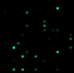
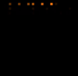
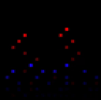
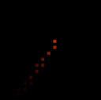
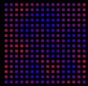
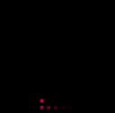
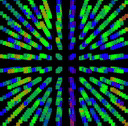
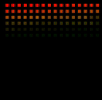
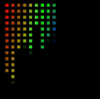
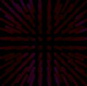

# How to create stunning effects with Live Scripts

Live Scripts let you write your own light effects in a simple C-like language — compiled and run directly on the ESP32. No PC, no compilation step, no toolchain. You type code, press save, and the lights respond within a second.

This tutorial walks you from a single blinking pixel to a full 3D audio-reactive noise effect. Each step builds on the previous one. By the end you will have a complete script that looks beautiful on a 1D strip, a 2D matrix, and a 3D cube — all from the same code.

Before you start: follow the [Live Scripts guide](livescripts.md) to upload and run a script.
Check especially [Important notes](livescripts.md#important-notes)

---

## Step 1 — Hello World: one pixel

The simplest possible effect. Pick a random LED and light it blue.

```c
// E_Hello1D.sc
void loop() {
  setRGB(random16(NUM_LEDS), CRGB(0, 0, 255));
}
```

`loop()` is called every frame. `NUM_LEDS` is the total number of lights. `random16(max)` returns a number from 0 to max−1. `CRGB(r, g, b)` is a colour.

Run this and you will see random blue flashes across all your lights.


---

## Step 2 — Trails with fadeToBlackBy

Random flashes are fine but trails make motion feel alive. Add one line:

```c
// E_Random1D.sc
void loop() {
  fadeToBlackBy(20);
  setRGB(random16(NUM_LEDS), CRGB(0, 255, 128));
}
```

`fadeToBlackBy(amount)` dims every LED a little each frame. With amount = 20 (out of 255), a pixel fades to black in about 13 frames. Lower = longer trail. Higher = shorter trail.

**Try it:** change the amount between 5 and 200 and watch the behaviour change.



---

## Step 3 — Smooth motion with oscillators

Random motion is unpredictable. For smooth, repeating animation, use oscillators — values that cycle back and forth at a fixed rhythm.

### `beatsin8` — the BPM sine wave

```
beatsin8(bpm, lo, hi, timebase, phase)
```

Returns a value that smoothly sweeps between `lo` and `hi`, `bpm` times per minute. Think of it as a gentle wave, timed to music tempo.

```c
// E_Sweep2D.sc
uint8_t bpm = 60;

void setup() {
  addControl(&bpm, "bpm", "slider", 10, 200);
}

void loop() {
  fadeToBlackBy(40);
  uint8_t pos = beatsin8(bpm, 0, NUM_LEDS - 1, 0, 0);
  setRGB(pos, CRGB(255, 128, 0));
}
```

A glowing amber dot sweeps back and forth at 60 BPM. Change `bpm` and it syncs to any music tempo.



### Multiple oscillators at different speeds

The magic starts when you combine oscillators. Two sines at different speeds never repeat the same pattern:

```c
// E_Oscillate2D.sc
void loop() {
  fadeToBlackBy(30);
  uint8_t pos1 = beatsin8(60,  0, NUM_LEDS - 1, 0, 0);
  uint8_t pos2 = beatsin8(37,  0, NUM_LEDS - 1, 0, 0);
  setRGB(pos1, CRGB(255, 0, 0));
  setRGB(pos2, CRGB(0, 0, 255));
}
```

Red and blue dots chase each other, crossing and diverging in an ever-changing dance.



---

## Step 4 — Beautiful colours with ColorFromPalette

Hard-coded RGB values work, but the palette system gives you rich, pre-tuned colour sets — and the user can swap them at runtime without touching the script.

```c
ColorFromPalette(index, brightness)
```

`index` is 0–255: a position in a colour wheel. `brightness` is 0–255.

```c
// E_Sweep2D.sc  (updated)
uint8_t bpm = 60;
uint8_t hue = 0;

void setup() {
  addControl(&bpm, "bpm", "slider", 10, 200);
}

void loop() {
  fadeToBlackBy(30);
  hue++;
  uint8_t pos = beatsin8(bpm, 0, NUM_LEDS - 1, 0, 0);
  setRGBPal(pos, hue, 255);
}
```

`setRGBPal(index, palIndex, brightness)` is a shorthand for set-from-palette. `hue++` shifts the colour every frame, cycling through the full palette continuously.


---

## Step 5 — Going 2D with setRGBXY

So far everything works on a flat array of LEDs. If your lights are arranged in a grid — a matrix, a panel — you can address them by (x, y) coordinates.

```c
setRGBXY(x, y, color)
```

The layout maps coordinates to physical LEDs. Your script does not need to know how they are wired; just use x from 0 to `width−1` and y from 0 to `height−1`.

### Bouncing ball on a 2D grid

```c
// E_Ball2D.sc
uint8_t bpm = 40;

void setup() {
  addControl(&bpm, "bpm", "slider", 10, 120);
}

void loop() {
  fadeToBlackBy(40);
  int x = beatsin8(bpm,      0, width  - 1, 0, 0);
  int y = beatsin8(bpm * 13 / 10, 0, height - 1, 0, 0);
  setRGBXY(x, y, ColorFromPalette(millis() / 20, 255));
}
```

Two `beatsin8` calls with slightly different speeds create a Lissajous curve — a looping figure-eight pattern. The ratio 13/10 means the vertical frequency is 1.3× the horizontal, giving a pattern that shifts gracefully over time.



### A 2D noise field

Perlin noise is a smooth pseudo-random function. Feed it two coordinates and it returns a value that changes continuously — perfect for organic, flowing animations.

```c
// E_Noise2D.sc
uint8_t speed = 128;
uint8_t scale = 128;

void setup() {
  addControl(&speed, "speed", "slider", 1, 255);
  addControl(&scale, "scale", "slider", 1, 255);
}

void loop() {
  for (int y = 0; y < height; y++) {
    for (int x = 0; x < width; x++) {
      uint8_t n = inoise8(x * scale, y * scale, now() / (16 - speed/16));
      CRGB color = ColorFromPalette(n, 255);
      setRGBXY(x, y, color);
    }
  }
}
```

`inoise8(x, y, z)` takes three coordinates. Using `now()` (milliseconds since boot) as the third dimension makes the field evolve through time — the pattern flows and ripples like fire or water.

**Try it:** use the Fire palette. With `speed = 100` and `scale = 80` you get convincing fire that works on any matrix size.



---

## Step 6 — Trigonometry: sin and cos

Sine and cosine are the building blocks of circular motion. A point moving around a circle has:

```
x = cx + radius * cos(angle)
y = cy + radius * sin(angle)
```

As `angle` increases from 0 to 2π, the point traces a perfect circle. Use `sin8`/`cos8` for fast integer math (0–255 range instead of −1…1):

```c
// E_Orbit2D.sc
void loop() {
  fadeToBlackBy(20);
  uint8_t angle = millis() / 10;   // increases over time
  int cx = width  / 2;
  int cy = height / 2;
  int r  = (cx < cy) ? cx : cy;
  int x  = cx + r * (cos8(angle) - 128) / 128;
  int y  = cy + r * (sin8(angle) - 128) / 128;
  setRGBXY(x, y, ColorFromPalette(angle, 255));
}
```

`cos8` and `sin8` return 0–255. Subtracting 128 centres them at zero, then divide by 128 to scale into −1…+1 range. The result is a glowing dot orbiting the centre, cycling through the palette.

**Extend it:** run a second orbit at a different speed using `angle * 3 / 2` for a spirograph effect.



---

## Step 7 — Adding depth: setRGBXYZ

If your lights are arranged in 3D — a cube, a volumetric display, a Christmas tree — use `setRGBXYZ`:

```c
setRGBXYZ(x, y, z, color)
```

Coordinates go from 0 to `width−1`, `height−1`, `depth−1`.

### 3D noise

Extend the noise example by adding a third spatial dimension:

```c
// E_Noise3D.sc
uint8_t scale = 128;

void setup() {
  addControl(&scale, "scale", "slider", 1, 255);
}

void loop() {
  for (int z = 0; z < depth; z++) {
    for (int y = 0; y < height; y++) {
      for (int x = 0; x < width; x++) {
        uint8_t n = inoise8(x * scale, y * scale + z * scale / 2, now() / 20);
        CRGB color = ColorFromPalette(n, 255);
        setRGBXYZ(x, y, z, color);
      }
    }
  }
}
```

Each slice through the cube looks like a shifting 2D noise field. The z offset in the noise coordinates makes adjacent layers look related but distinct — like a 3D fire or fog.



---

## Step 8 — Audio reactive with bands and volume

`bands[16]` gives you 16 frequency bins from bass (index 0) to treble (index 15), each 0–255. `volume` is the overall loudness as a float.

### Simplest audio effect: VU meter on a strip

```c
// E_Vu1D.sc
void loop() {
  fadeToBlackBy(60);
  int lit = (int)(volume/400 * NUM_LEDS);
  if (lit >= NUM_LEDS) lit = NUM_LEDS;
  for (int i = 0; i < lit; i++) {
    setRGBPal(i, i * 255 / NUM_LEDS, 255);
  }
}
```

The number of lit LEDs follows the volume. The colour sweeps from one end of the palette to the other so loud = lots of colour.



### Frequency columns on a 2D matrix

Map each column to a frequency band:

```c
// E_Geq2D.sc
uint8_t fade = 200;

void setup() {
  addControl(&fade, "fade", "slider", 1, 255);
}

void loop() {
  fadeToBlackBy(fade);
  for (int x = 0; x < width; x++) {
    uint8_t band  = x * 16 / width;
    uint8_t level = bands[band];
    int     barH  = level * height / 255;
    for (int y = 0; y < barH; y++) {
      setRGBXY(x, y, ColorFromPalette(x * 255 / width + y * 4, 255));
    }
  }
}
```

Each column shows the energy of one frequency band. The colour shifts with position so bass is one hue and treble another.



---

## The final effect — Cosmic Noise

This is the effect the whole tutorial has been building toward. It combines Perlin noise, BPM oscillators, and palette colours into something that looks completely different on a 1D strip, a 2D matrix, and a 3D cube — all from the same code.

**How it works:**

- A 3D noise field fills all LEDs with smoothly flowing colour
- A `beatsin8` oscillator pulses the brightness at a musical tempo, adding rhythm
- The noise time axis is driven by `volume` — louder music = faster flow
- The palette colours the noise so the result looks like living fire or aurora borealis

```c
// E_Cosmic.sc
uint8_t bpm   = 60;
uint8_t scale = 80;
uint8_t speed = 100;

void setup() {
  addControl(&bpm,   "bpm",   "slider", 10, 200);
  addControl(&scale, "scale", "slider",  1, 255);
  addControl(&speed, "speed", "slider",  1, 255);
}

void loop() {
  // Pulse the overall brightness to the beat
  uint8_t pulse = beatsin8(bpm, 120, 255, 0, 0);

  for (int z = 0; z < depth; z++) {
    for (int y = 0; y < height; y++) {
      for (int x = 0; x < width; x++) {
        // 3D noise — time axis driven by speed and volume
        uint32_t t = now() * speed / 100 + (uint32_t)(volume * 2000);
        uint8_t  n = inoise8(x * scale, y * scale + z * 37, t / 20);

        // Colour from palette, brightness modulated by beat pulse
        uint8_t bright = n * pulse / 255;
        setRGBXYZ(x, y, z, ColorFromPalette(n, bright)); // this works !!
      }
    }
  }
}
```

On a 1D strip (`height=1`, `depth=1`) you get a flowing ribbon of colour that pulses to the beat. On a 16×16 matrix you get aurora-like curtains. On a cube, the whole volume breathes.

**Try these palette+parameter combinations:**

| Palette  | bpm | scale | speed | Result |
|----------|-----|-------|-------|--------|
| Fire     | 60  | 60    | 120   | Dancing fire |
| Ocean    | 40  | 100   | 60    | Slow ocean swell |
| Rainbow  | 90  | 50    | 150   | Fast psychedelic flow |
| Forest   | 50  | 120   | 40    | Deep forest breathing |



---

## What's next

You now know the core building blocks: oscillators, noise, trigonometry, colour palettes, and audio reactivity. Mix and combine them. Some ideas:

- Use `bands[0]` (bass) to trigger a flash and `beatsin8` for the movement between beats
- Use `sin8` and `cos8` to draw rings and spirals with `drawCircle`
- Use `gravityX` / `gravityY` from an IMU to make effects that respond to tilting the fixture
- Use `hour`, `minute`, `second` (NTP) to make a clock effect

All example scripts are on GitHub: [Effects](https://github.com/MoonModules/MoonLight/tree/main/livescripts/Effects), [Layouts](https://github.com/MoonModules/MoonLight/tree/main/livescripts/Layouts), [Palettes](https://github.com/MoonModules/MoonLight/tree/main/livescripts/Palettes).

For the full function reference, see the [Live Scripts module page](livescripts.md#available-functions).

To share your effects or ask for new functions, join the [Discord channel](https://discord.com/channels/700041398778331156/1369578126450884608).
