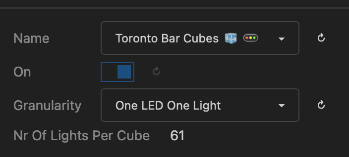
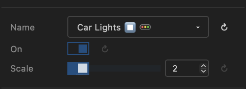

# Layouts

A layout (🚥) tells MoonLight **where your lights physically are** and **how they are wired**. Get this right and every effect — from a simple rainbow to a 3D plasma — automatically fits your fixture perfectly.

## How layouts work

### The coordinate grid

When you define a layout, each light gets a position in a 3D coordinate space (X, Y, Z). MoonLight takes all those positions and figures out the bounding box — the smallest grid that contains every light. Effects are then computed across that whole grid and automatically mapped to your physical lights.

This means:

- **Effects are fixture-aware.** A plasma effect on a 16×16 panel looks like a full-screen plasma. The same effect on a 3D cube wraps correctly around all three axes. You don't write a different effect for each shape.
- **Wiring order doesn't matter to effects.** Your LED strip might snake left-to-right on odd rows and right-to-left on even rows (serpentine wiring). The layout describes that wiring pattern; effects just see a clean grid.
- **Resolution scales automatically.** A 10×10 panel and a 32×32 panel both run the same effects — the effect adapts to however many lights you have.

### 1D, 2D and 3D fixtures

| Fixture type | Typical examples | Grid shape |
|---|---|---|
| **1D** — a line | LED strip, LED bar, single tube | Y axis only — X and Z are 0. The Y axis runs vertically so 1D effects like bouncing balls, drip and rain move in the natural downward direction |
| **2D** — a flat surface | LED matrix, panel, ring, wheel | X and Y axes — Z is 0 |
| **3D** — a volume | Cube, Christmas tree, spiral tower, Human Sized Cube | X, Y and Z axes all used |

MoonLight automatically detects the dimensionality from the coordinates you define, so 1D effects run on strips and 3D effects light up cubes without any extra configuration.

### How effects fill the grid

The effect runs across every point in the bounding grid, but your fixture only has lights at specific positions inside it. MoonLight builds a **mapping** that links each grid point to the nearest physical light — so even a 500-LED Christmas tree mounted inside a 25×25×100 bounding box gets a smooth, full-volume effect. Sparse fixtures (few lights in a large space) work fine as long as the pixel density is reasonable. Very sparse grids — for example, a handful of moving heads spread across a large stage — are a future use case.

### Multiple layout nodes

You can add more than one layout node — for example three separate panels or a ring combined with a bar. MoonLight merges all their positions into a single shared grid and maps effects across all of them together. Lights are assigned to the grid in the order the layouts appear in the node list.

### GPIO pin assignment

Layouts also assign groups of LEDs to the ESP32 GPIO pins that drive them. Each layout node controls which pin(s) its lights are connected to. Complex fixtures like a cube or a multi-panel wall often use one pin per face or one pin per panel so each segment can be driven in parallel, improving performance.

!!! tip "Start simple"
    Not sure which layout to use? Start with **Single Row** for a strip, **Panel** for a matrix, or **Rings** for circular fixtures. These cover the most common setups and are easy to combine into larger builds.

!!! tip "Custom shapes"
    Any shape that isn't covered by the built-in layouts can be created as a **Live Script** — a small `.sc` file with an `onLayout()` function that places lights exactly where you need them. See [Live Scripts](livescripts.md).

!!! note "Future: room-scale mapping"
    It is possible in principle to treat an entire room or stage as the coordinate space and map all fixtures — panels, moving heads, tubes — into that shared grid. This would let effects flow seamlessly from one fixture to another across physical space. MoonLight's architecture supports it, but algorithms optimised for very sparse, large-scale grids are not yet implemented.

## Layout 🚥 Nodes

Below is a list of Layouts in MoonLight. 
Want to add a Layout to MoonLight, see [develop](https://moonmodules.org/MoonLight/develop/overview/). You can also create custom layouts as [Live Scripts](https://moonmodules.org/MoonLight/moonlight/livescripts/) using `onLayout()`, `addLight()`, and `nextPin()`.

| Name | Preview | Controls | Remarks
| ---- | ----- | ---- | ---- |
| Panel | |  | Defines a 2D panel with width and height Wiring Order (orientation): horizontal (x), vertical (y), depth (z) X++: starts at Top or bottom, Y++: starts left or right snake aka serpentine layout|
| Panels |  |  | Panel layout + Wiring order, directions and snake also for each panel |
| Cube |  |  | Panel layout + depth  Z++ starts front or back multidimensional snaking, good luck 😜 |
| Rings |  |  | 241 LEDs in 9 rings |
| Wheel |  |  | |
| Human Sized Cube |  |  | |
| Toronto Bar Gourds |  |  | |
| Car Lights |  |  | |
| Single Column |  |  | Choose Single Column for LED strips |
| Single Row |  |  | |
| SE16 |  |  | Layout(s) including pins for Stephan Electronics 16-Pin ESP32-S3 board see below |
| LightCrafter16 |  |  | Layout(s) for Stephan Electronics LightCrafter16 ESP32-S3 board see below |

!!! warning "Choosing pins"

    Choose the right pins with care. See also the IO module to see which pins can in general be used for LEDs (💡). But depending on a specific boards some pins might also be in use already. 

!!! tip "Multiple layouts"
    Single line, single row or panel are suitable layouts to combine into a larger fixture.

### SE16

16-channel LED strip driver by Stephan Electronics

* Leds Per Pin: the number of LEDs connected to each pin
* Pins Are Columns: are the LEDs on a pin a row of the effect (width is 1 (or 2) x ledsPerPin). If not set the LEDs are a column (height is 1 (or 2) x ledsPerPin)
* Mirrored Pins: If set it is assumed that LEDs are connected with increasing positions on 8 pins on one side of the board and decreasing positions on the 8 pins of the other side of the board. The resulting size will have a width of 8 and the height (or width) will be 2 * ledsPerPin. If not set, the width will be 16 and the height (or width) = ledsPerPin

### LightCrafter16

16-channel LED strip driver by Stephan Electronics

* Leds Per Pin: the number of LEDs connected to each pin
* Pins Are Columns: are the LEDs on a pin a row of the effect (width is 1 (or 2) x ledsPerPin). If not set the LEDs are a column (height is 1 (or 2) x ledsPerPin)

X0Y0 position is on the top left when the board is positioned in such a way that the Ethernet connector is on the top left.