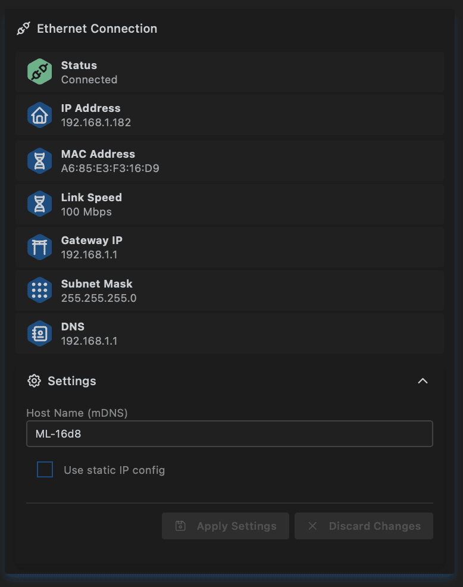

# Ethernet

See [IO module](../moonbase/inputoutput.md) to setup pins for Ethernet on S3 boards.

When Ethernet is connected, Wi‑Fi Station reconnection is suppressed on non‑PSRAM targets to save heap.  
When Ethernet disconnects, Wi‑Fi reconnection is resumed by the normal STA management loop (not immediately in the Ethernet handler).  
Access Point behavior depends on Provision Mode; it is not universally disabled by Ethernet state.