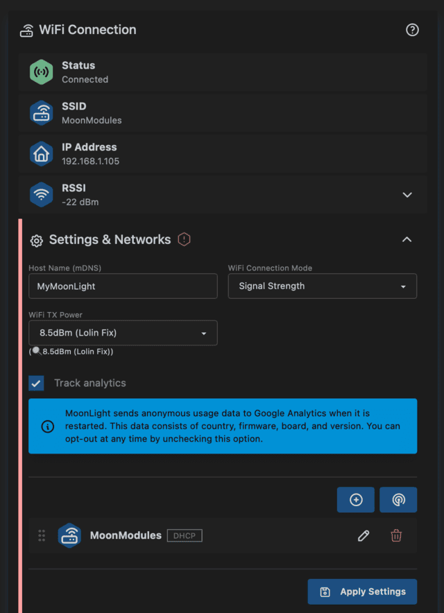

# WiFi Station

* **Hostname**: The hostname you set here is used as the device name everywhere in MoonLight: mDNS (for `.local` access), the Access Point name, and the name shown in the Devices module. Configure it once here and it applies across all network interfaces.

* **WiFi TX Power** 🌙: WiFi transmit power can be set to optimize WiFi behavior. Some boards are known to work better by setting transmit power to 8.5 dBM (So called LOLIN_WIFI_FIX).
    * Default is typically 20 dBm (100mW) - the maximum allowed
    * Common recommended settings:
	    * For most indoor applications: 15-17 dBm
	    * For battery-powered devices: 10-15 dBm
	    * For close-range applications: 8-12 dBm
    * 🚨: When the board is in AP mode, it is set to 8.5dBM as most boards work okay with this. WiFi is also initially set to 8.5dBM

## 🔒 MoonLight Analytics

MoonLight can send **anonymous** usage data to Google Analytics when the device starts.
This helps the MoonModules team understand which hardware and firmware versions are in use,
so development can focus where it matters most.

### What is collected

| Data | How it is obtained |
|---|---|
| Country (e.g. "France") | Your device's IP address is sent to [ip-api.com](http://ip-api.com) to look up the country. Only the country field is then forwarded to Google Analytics — the IP itself is not sent to Google. |
| Firmware type (e.g. `esp32-s3-n16r8v`) | Read from the build configuration. |
| Board model (e.g. `QuinLED DigQuad`) | Read from board presets (when available). |
| MoonLight version (e.g. `0.6.0`) | Read from the build. |

No names, email addresses, MAC addresses, or other information that can identify a person are
collected or sent.

Each analytics event is sent with a **random, anonymous client ID** that is re-generated on
every restart — no persistent device or user tracking is possible.

### How data is processed

- **ip-api.com** receives your device's IP address to determine country.
- **Google Analytics (GA4)** receives the four fields above plus the random client ID.
  Google LLC is certified under the [EU-US Data Privacy Framework](https://www.dataprivacyframework.gov/)
  (since August 2023), which provides a legal basis for EU-to-US data transfers under GDPR.
  This framework remains in force but is subject to ongoing legal review.
- No other parties receive your data.

### Legal basis

For users in the European Union, data is processed under **legitimate interests**
(GDPR Art. 6(1)(f)). The processing is proportionate: only four non-personal fields are
collected, no persistent identity is created, and you can opt out at any time (see below).

For users in Switzerland, the Swiss Federal Act on Data Protection (FADP, in force since
September 2023) does not require a legal basis for ordinary data processing; transparency
and the right to object are the primary obligations, both of which are met here.

> ℹ️ _MoonModules is an open-source community project, not a commercial entity. We use this
> data solely to prioritise development — not for advertising or commercial profiling._

### How to opt out

Disable **Track analytics** in this settings panel. The change takes effect immediately on
the next restart.