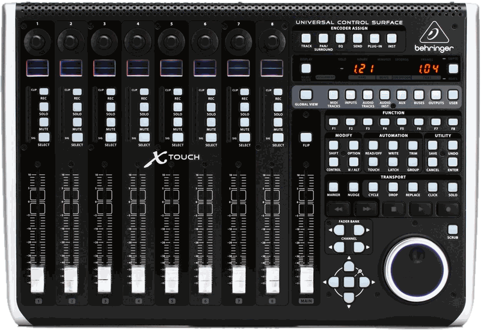
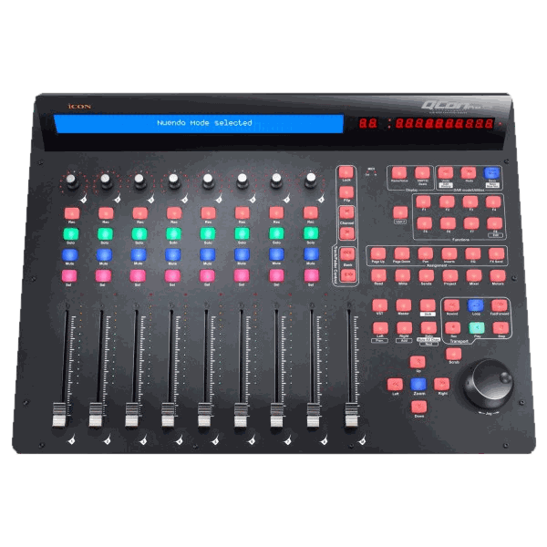
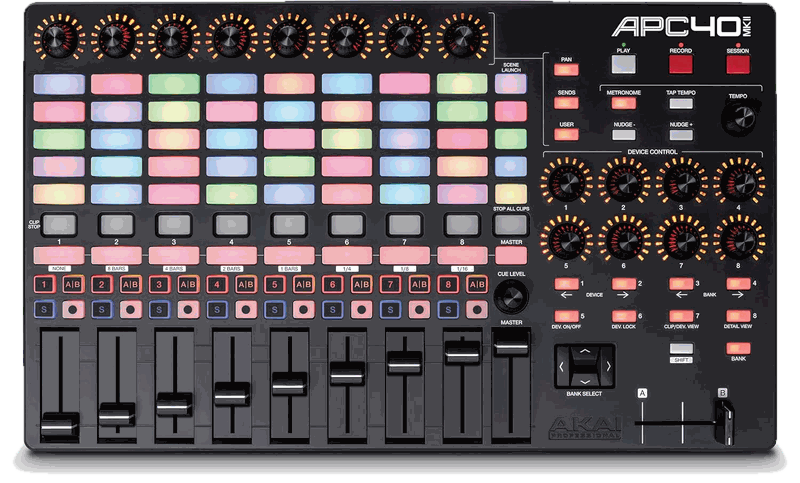

# Control surfaces: hardware reference

The physical desks on the bench, and Mackie Control as it travels on the wire. A desk here drives [ControlModule](../../moonmodules/core/system.md#control)'s encoders, faders and switches, which were laid out to match this class of hardware. How to connect one: [Connecting a control surface](../../how-to/control-surface.md).

**None of these desks speaks OSC.** The X-Touch and the QCon are **Mackie Control** surfaces over MIDI, which MoonLight reads through its [MIDI service](../../moonmodules/core/services.md#midi).
The APC40 mkII has a MIDI layout of its own.

## Behringer X-Touch (Universal)

The larger of the Mackie desks, and the only desk here with a network port.

**Sources:** [product page](https://www.behringer.com/product.html?modelCode=0808-AAF) · [Ardour's notes on Behringer in MCU mode](https://manual.ardour.org/using-control-surfaces/mackie-control-protocol/behringer-devices-in-mackielogic-control-mode/)

| | |
|---|---|
| Faders | 9 x 100 mm touch-sensitive **motorized** (8 channel + 1 master) |
| Encoders | 8 rotary push-encoders with LED rings |
| Display | LCD scribble strips per channel |
| Protocols | **Mackie Control (MCU)**, HUI, plain MIDI |
| Connectivity | USB-B (MIDI), 5-pin DIN MIDI in/out, **RJ45 Ethernet for RTP-MIDI** |
| Not supported | OSC |

**The Ethernet port carries RTP-MIDI, not OSC.** RTP-MIDI (RFC 6295, UDP port 5004) is MIDI tunneled over a network with a session layer.
That layer is an invitation handshake, synchronization, and a journal, so a dropped packet can be recovered rather than losing a note. It is a real protocol to implement, not a framing detail, which is what separates "reach this desk over the LAN" from "reach it over USB".

## iCON QCon Pro G2

**Sources:** [product page](https://iconproaudio.com/product/qcon-pro-g2/) · [user manual (PDF)](https://c3.zzounds.com/media/QCONPX-User-manual-English-7481d0b0d7b94af8a008c7e2634d0f59.pdf)

| | |
|---|---|
| Faders | 9 x touch-sensitive **motorized** (8 channel + 1 master) |
| Encoders | 8 push-encoders with 11-segment LED rings |
| Display | backlit LCD, 12-segment LED level meter per channel |
| Buttons | 78, plus a jog/shuttle wheel and 2 foot-pedal inputs |
| Protocols | **Mackie Control (MCU)**, HUI |
| Connectivity | **USB 2.0 only** (class-compliant) |
| Not supported | OSC, Ethernet |

**No network port at all.** It reaches MoonLight through a computer's USB port and the browser, or straight through a board's own USB port, the MIDI service's `usb` setting.
It brings its own power adapter, so a board's port needs to supply no 5 V for it.

## What Mackie Control looks like on the wire

MCU is ordinary MIDI carrying agreed meanings, so a parser is small; the work is in the semantics and the feedback, not the bytes.

| element | encoding |
|---|---|
| Fader position | **pitch bend**, one MIDI channel per fader (channels 0-8 for faders 1-9). 14-bit, which is why a motorized desk feels smooth where a 7-bit CC would step |
| Fader touch | note on/off, notes 0x68 (104) to 0x70 (112), so the desk says when a hand is on a fader |
| Encoders | control change, relative (a turn sends a delta, not a position) |
| Encoder LED rings | control change back to the desk; the value's mode field picks dot / boost-cut / wrap / spread |
| Buttons and LEDs | note on/off, the same note number in both directions |
| Scribble strips | SysEx, `0x12` after the header, then the text |

**It is bidirectional by nature, and that is the point of the hardware.** The motors move only because the host sends fader positions back, and the scribble strips show only what the host writes. MoonLight's [MIDI service](../../moonmodules/core/services.md#midi) sends the positions, the button lights and the rings, so a preset change moves the faders.

## Akai APC40 mkII

A clip launcher built for Ableton Live: a grid of RGB pads above a row of eight channel strips, and no motors.

**Sources:** [product page](https://www.akaipro.com/apc40-mkii) · [communications protocol v1.2 (PDF)](https://cdn.inmusicbrands.com/akai/attachments/apc40II/APC40Mk2_Communications_Protocol_v1.2.pdf), the reference for every number below

| | |
|---|---|
| Faders | 9 x 45 mm, **not motorized** (8 track + 1 master), plus a crossfader |
| Knobs | 8 track knobs and 8 device knobs, each with a 15-segment LED ring; a tempo and a cue knob without rings |
| Pads | 40 RGB clip-launch pads (8 wide, 5 high) and 5 RGB scene-launch pads |
| Buttons per track | clip stop, track select, activator (numbered 1-8), crossfader A/B, solo, record arm |
| Other buttons | transport (play, record, session record), navigation (up, down, left, right, bank), shift, tap tempo, nudge, device and bank controls |
| Protocols | its own MIDI layout; not Mackie Control |
| Connectivity | **USB only** (class-compliant MIDI, bus-powered), one MIDI port, a footswitch input |
| Not supported | OSC, Ethernet, Mackie Control |

### Three modes

The host picks the mode with a SysEx message: `F0 47 7F 29 60 00 04 <mode> <version high> <version low> <bugfix> F7`.
The APC40 starts in Generic mode on every power-up.

| mode | byte | buttons | lights | knobs |
|---|---|---|---|---|
| Generic | `0x40` | activator, solo and record arm toggle themselves; track select sends nothing | the APC40 runs them | the device knobs follow the selected track |
| Ableton Live | `0x41` | momentary | the host, except the knob rings | not banked |
| Alternate Ableton Live | `0x42` | momentary | **all of them the host's** | not banked |

**Alternate Ableton Live mode suits a host that owns the state**, as MoonLight's control surface does.
Every press only reports and every light shows what the host sends, so a value changed elsewhere never leaves a light out of step.
A browser needs the user's permission to send SysEx.

### On the wire

| control | message | channel | number | value |
|---|---|---|---|---|
| Track fader 1-8 | control change | track 1-8 = 0-7 | 7 | 0-127, absolute |
| Master fader | control change | 0 | 14 | 0-127 |
| Crossfader | control change | 0 | 15 | 0-127 |
| Device knob 1-8 | control change | 0 (banked per track in Generic mode) | 16-23 | 0-127, absolute |
| Track knob 1-8 | control change | 0 | 48-55 | 0-127, absolute |
| Tempo, cue level | control change | 0 | 13, 47 | relative: 1-63 up, 127 down to 64 |
| Footswitch | control change | 0 | 64 | 127 pressed, 0 released |
| Clip launch 1-40 | note | 0 | 0-39, bottom-left first | press 127, release note off |
| Record arm, solo, activator, track select, clip stop | note | track 1-8 = 0-7 | 48, 49, 50, 51, 52 | press 127 |
| Crossfader A/B | note | track 1-8 = 0-7 | 66 | press 127 |
| Scene launch 1-5 | note | 0 | 82-86 | press 127 |
| Device and bank controls | note | 0 | 58-65 | press 127 |
| Master, stop all clips | note | 0 | 80, 81 | press 127 |
| Pan, sends, user, metronome | note | 0 | 87-90 | press 127 |
| Play, stop, record | note | 0 | 91, 92, 93 | press 127 |
| Up, down, right, left | note | 0 | 94, 95, 96, 97 | press 127 |
| Shift, tap tempo, nudge -, nudge + | note | 0 | 98, 99, 100, 101 | press 127 |
| Session record, bank lock | note | 0 | 102, 103 | press 127 |

The clip pads count from the bottom-left: notes 0-7 are the bottom row and 32-39 the top row, left to right.
The protocol does not say so; it was measured on the device.
A release arrives as a note off.

### The way back

A light takes the same number its control sends, in the other direction.

- **A one-color light** (activator, solo, record arm, track select and the rest): a note on with velocity 1-127 lights it, velocity 0 or a note off clears it. Clip stop also blinks at velocity 2, in step with the tempo; crossfader A/B shows yellow at 1 and orange at 2-127.
- **An RGB pad** (clip launch and scene launch): the velocity picks one of 128 colors from Akai's palette, 0 being off.
  The channel picks how it shows: 0 is steady, 1-5 a one-shot, 6-10 pulsing and 11-15 blinking.
  Each of the last three runs at a rate from 1/24 to 1/2 of the tempo.
- **A knob ring**: the knob's own control change, 0-127, sets its position. The ring style is a second control change, 56-63 for the track knobs and 24-31 for the device knobs.
  Its value 0 is off, 1 a single light, 2 fills like a volume meter and 3 fills out from the center like a pan control.

### Where it fits MoonLight

The [Control](../../moonmodules/core/system.md#control) surface has eight faders, eight encoders, eight switches and a grid of preset pads.
The APC40 has a control for each:

| APC40 | Control surface |
|---|---|
| Track faders 1-8 | `fader1` to `fader8` |
| Track knobs 1-8, with their rings | `encoder1` to `encoder8` |
| Activator buttons 1-8, with their lights | `switch1` to `switch8` |
| Clip pads 1-40, with their colors | the first 40 preset pads |

