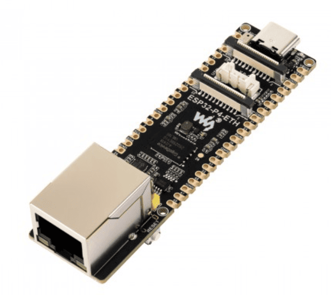

# Waveshare ESP32-P4-ETH hardware reference

Pin maps and onboard features for the **Waveshare ESP32-P4-ETH**, read from the schematic so MoonLight work reads this instead of re-scraping the PDF. The board runs the plain `esp32p4rev1-eth` firmware, the same build the P4-NANO uses, and is `"Waveshare ESP32-P4-ETH"` in the device catalog.

**Sources**
- Schematic: <https://files.waveshare.com/wiki/ESP32-P4-ETH/ESP32-P4-ETH-datasheet.pdf>
- Board drawing: <https://files.waveshare.com/wiki/ESP32-P4-ETH/ESP32-P4-ETH.zip>

Same family as the Waveshare ESP32-P4-NANO: ESP32-P4, RISC-V dual-core, the same onboard IP101 Ethernet PHY wiring, and the same CSI/DSI/I2C accessory-bus convention. See [gpio-usage.md § ESP32-P4](gpio-usage.md#esp32-p4) for the pin map. It carries the same onboard **ES8311** audio codec, feeding an SMD mic and a 2-pin JST speaker header. The [MHC-WLED ESP32-P4 shield](mhc-wled-esp32-p4-shield.md) is a different, unrelated P4 carrier board, with RS-485/line-in and no onboard codec.

## Audio (ES8311 codec)

The onboard SMD mic and speaker header connect through an **ES8311 mono codec** and an **NS4150B** class-D amplifier, the same amplifier chip the ESP32-S31 uses. The ESP is the I2S master, driving MCLK.

| Signal | GPIO | Role |
|---|---|---|
| I2S MCLK | 13 | master clock to the codec, 256 × sample_rate |
| I2S SCLK (BCLK) | 12 | bit clock |
| I2S LRCK (WS) | 10 | word select |
| I2S ASDOUT | 11 | mic data, codec to ESP, the record path |
| I2S DSDIN | 9 | speaker data, ESP to codec; wired on the board, playback is not implemented |
| ESP_I2C_SDA | 7 | codec control bus, shared with the CSI/DSI accessory headers |
| ESP_I2C_SCL | 8 | codec control bus |
| PA_Ctrl | 53 | NS4150B amplifier enable; wired on the board, not implemented |

The ES8311's I2C address is `0x18`, the hardware default with no address-select strap. The catalog entry configures [AudioService](../../moonmodules/core/moxygen/AudioService.md)'s ES8311 codec on these pins, through the board's [I2cBusModule](../../moonmodules/core/moxygen/I2cBusModule.md). The speaker path (DSDIN, PA_Ctrl) is a separate, unimplemented capability.

## Ethernet (IP101GRI PHY, RMII)

The board uses the `P4 RMII` preset, shared with the Waveshare P4-NANO: MDC 31, MDIO 52, PHY reset 51, reference clock 50 (see [EthernetModule](../../moonmodules/core/moxygen/EthernetModule.md)). The RMII data lines, fixed by the chip and not part of that preset, read from the schematic:

| Signal | GPIO |
|---|---|
| TXD0 | 34 |
| TXD1 | 35 |
| TXEN | 49 |
| RXD0 | 29 |
| RXD1 | 30 |
| RXDV | 28 |

## microSD slot

Wired on the board; MoonLight does not mount it:

| Signal | GPIO |
|---|---|
| D0 | 39 |
| D1 | 40 |
| D2 | 41 |
| CD/D3 | 42 |
| CLK | 43 |
| CMD | 44 |
| VDD gate (pMOS) | 45 |

## Other onboard features

From the Waveshare wiki: MIPI-CSI (2-lane, OV5647-compatible) and MIPI-DSI (2-lane, 5, 7, 8 and 10.1-inch panels) accessory headers, plus BOOT and RESET buttons. USB-C is native, with D- on GPIO 24 and D+ on GPIO 25, and a UART-bridge variant also exists.
